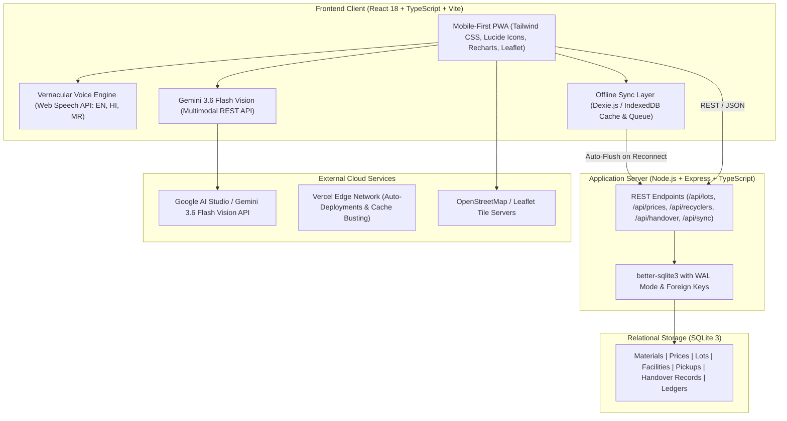

# KABADIWALA CONNECT — COMPLETE SYSTEM DOCUMENTATION
### Smart India Hackathon 2026 | Problem Statement ID: 26229
**Issuing Authority**: Ministry of Mines (MoM) / Jawaharlal Nehru Aluminium Research Development and Design Centre (JNARDDC)  
**Problem Statement**: *"Kabadiwala Connect – Bringing the Informal Collector into the Formal Recycling Chain"*

---

## 1. Project Overview & Vision

India produces over **3.2 million tonnes of electronic waste annually**, ranking as the third-largest producer in the world. However, **more than 90–95% of this waste flows through the informal sector**—an estimated network of 1.5 million grassroots scrap collectors (*kabadiwalas*) and informal godown dismantlers.

### The Systemic Challenges:
1. **Middlemen Exploitation & Information Asymmetry**: Informal collectors sell complex electronic components (such as server motherboards, multi-layer PCBs, and lithium batteries) as generic scrap or mixed iron, losing **40% to 60% of true intrinsic value**.
2. **Severe Health & Environmental Degradation**: Informal recovery relies on crude, dangerous methods:
   - *Open-air cable burning* releasing cancer-causing dioxins, furans, and lead particles.
   - *Cyanide and nitric acid baths* for rudimentary gold leaching, causing acid burns, toxic fumes, and soil/water pollution.
   - *Hammer smashing of lithium-ion cells*, leading to volatile fires and permanent damage.
3. **Loss of Strategic Critical Minerals**: Rare and high-value materials essential to national security and green transitions (**Copper, Lithium, Cobalt, Neodymium, Tantalum, Gold, Indium**) are either lost in landfills or recovered with sub-25% extraction efficiency.
4. **Zero Legal & Financial Identity**: Kabadiwalas operate entirely off-the-books, possessing no CPCB compliance proof, no verifiable transaction history, and zero access to institutional micro-credit (e.g. PM SVANidhi).

### The Solution — Kabadiwala Connect:
**Kabadiwala Connect** is a production-grade full-stack civic-tech platform that integrates the informal e-waste collector into the formal, CPCB-certified circular economy. It features:
* **Mobile-First Low-Literacy Interface**: Tactile design, 100% trilingual vernacular reactivity (English, Hindi, Marathi), and native voice speech synthesis.
* **Live Google Gemini 3.6 Flash Multimodal Vision AI**: Instant photo-based component identification, grading, critical mineral extraction forecasting, and hazard guidance.
* **Guaranteed Minimum Support Benchmark Rates**: Dynamic commodity price boards tied to Ministry of Mines benchmarks.
* **Offline-First Resilience**: Browser-level IndexedDB (Dexie.js) caching with automatic background synchronization upon reconnection.
* **Calibrated 2-Party Scale Reconciliation**: QR manifest generation and verifiable digital handover certificates with instant simulated UPI payouts.
* **Verifiable Digital Khata**: Legitimate transaction passbooks enabling financial inclusion and bank loan readiness.
* **National Mineral Tracking & Oversight**: Geospatial heatmaps, critical mineral recovery analytics, and unit economics simulations for JNARDDC / Ministry regulators.

---

## 2. Live Links & Project Coordinates

| Platform / Service | Link / Coordinate | Status |
| :--- | :--- | :--- |
| **Live Production Web App** | [https://kabadiwala-connect-khaki.vercel.app](https://kabadiwala-connect-khaki.vercel.app) | `Active` (Vercel Global CDN) |
| **GitHub Repository** | [https://github.com/Itsmeaadeesh/KABADI-VALA](https://github.com/Itsmeaadeesh/KABADI-VALA) | `Active` (`main` branch) |
| **Local Dev Server** | `http://localhost:5174` (Client) & `http://localhost:5001` (Backend) | Verified & Tested |
| **Problem Statement** | SIH 2026 — Problem Statement ID: 26229 | Ministry of Mines / JNARDDC |

---

## 3. High-Level Architecture & Tech Stack



### Full Technology Breakdown:
* **Frontend Framework**: React 18.3, Vite 6, TypeScript 5.
* **Styling & Design System**: Tailwind CSS v3 with custom civic palette (`brand-50` through `brand-950`), custom scrollbars, safe-area inset management, and zero emojis (100% vector SVG icons via `lucide-react`).
* **AI & Computer Vision**: Google Gemini 3.6 Flash Multimodal API via direct REST payload with structured JSON schema enforcement.
* **Offline-First Storage**: Dexie.js (IndexedDB wrapper) with optimistic UI updates and background sync queue.
* **Vernacular Audio**: Web Speech API (`SpeechSynthesis`) with localized phrase builders in Hindi (`hi-IN`), Marathi (`mr-IN`), and English (`en-IN`).
* **GIS Mapping**: Leaflet and React-Leaflet with OpenStreetMap tiles and custom GPS facility pins.
* **Data Visualization**: Recharts (historical commodity price curves, regional flow heatmaps, critical mineral recovery bar charts).
* **Backend Runtime**: Node.js v24 LTS, Express.js, TypeScript.
* **Database**: `better-sqlite3` with Write-Ahead Logging (WAL mode), cascade constraints, and prepared statements.
* **PWA & Production Hardening**: Custom service worker (`sw.js`) with cache-busting, inline self-healing script, and React Error Boundary.

---

## 4. User Personas & Role-Based Access

The platform supports 3 distinct user personas, accessible via a 1-click switcher in the global header:

```text
┌──────────────────────────────────────────────────────────────────────────┐
│                      KABADIWALA CONNECT ROLES                            │
├──────────────────────────┬──────────────────────────┬────────────────────┤
│  1. COLLECTOR            │  2. RECYCLER             │  3. ADMIN          │
│  Ramesh Kumar (Dharavi)  │  Rajesh Sharma           │  Dr. S. K. Verma   │
│  Role: Informal Picker   │  Role: Facility Manager  │  Role: Regulator   │
│  Org: Local Kabadiwala   │  Org: GreenCycle (CPCB)  │  Org: JNARDDC/MoM  │
│  Phone: 9999999999       │  Phone: 8888888888       │  Phone: 7777777777 │
│  Portal: /collector      │  Portal: /recycler       │  Portal: /admin    │
└──────────────────────────┴──────────────────────────┴────────────────────┘
```

---

## 5. Screen-by-Screen Detailed Walkthrough

### 5.1. Public Landing Page (`/`)
Designed as a civic-tech gateway for citizens, municipal authorities, and scrap businesses:
* **Unified Global Header**: Clean brand logo, Ministry of Mines / JNARDDC subtitle, role switcher, sync status pill, and language selector (**EN**, **हिंदी**, **मराठी**).
* **Hero Section**:
  * Headline: *"From Kabadiwala to Circular Economy"*
  * Subtitle: *"Bridging the informal e-waste collector into the formal, traceable recycling ecosystem under SIH Problem Statement 26229."*
  * Primary Action: `Start Selling E-Waste` (leads to `/sell`).
  * Secondary Action: `Find Authorized Recycler` (leads to `/recyclers`).
* **Three Core Value Pillars**:
  1. *Fair Benchmark Rates*: Real-time pricing tied to actual commodity metals.
  2. *Safe Handling & Health*: Eliminates toxic open-air burning and acid leaching with a +5% Intact Quality Bonus.
  3. *Digital Traceability*: Verifiable CPCB manifests and digital passbook records for micro-finance.
* **Vector Circular Economy Pipeline**: Responsive visual cards mapping the 4-step formal journey:
  `Informal Collector` ➔ `Certified Recycler` ➔ `Verified Handover` ➔ `Formal Refining`.
* **Persona Portal Cards**: Direct entry cards for Collector, Recycler, and Government Admin.
* **Live Benchmark Price Ticker**: Real-time ticker streaming current per-KG buy rates for PCBs, Copper Wires, Batteries, and Motors.
* **Institutional Footer**: Government attribution, quick navigation links, and SIH 26229 compliance statement.

---

### 5.2. Collector Portal (`/collector`)

#### A. Collector Home (`/collector`)
* **Top Greeting & Location Banner**:
  * Personalized greeting: *"नमस्ते Ramesh"* / *"Welcome Ramesh"*.
  * Live GPS tag: *"Dharavi Sector 3, Mumbai • Live GPS Active"*.
  * Synced network status indicator.
  * Vernacular voice speaker button reading out greeting and instructions.
  * Current monthly earnings pill (e.g. ₹18,450) with quick jump to Khata.
* **Dominant Hero Card: SELL E-WASTE**:
  * Large green interactive touch card with camera icon, `AI Valuation` badge, and subtitle *"Sell safely & fairly • AI Valuation"*. Leads to `/sell`.
* **2x2 Tactile Action Grid**:
  * **PRICE (दाम देखें)**: Today's government-approved benchmark scrap rates ➔ `/prices`.
  * **RECYCLER (रीसाइक्लर खोजें)**: Nearest CPCB-authorized facilities ➔ `/recyclers`.
  * **MY LOTS (मेरे लॉट)**: Real-time tracking of registered digital manifests ➔ `/lots`.
  * **MY KHATA (मेरा खाता)**: Verifiable digital passbook ledger ➔ `/khata`.
* **Dedicated Safety Card (Full-Width)**:
  * Health guidelines, toxic hazard warnings, and instructions on how to earn the **+5% Intact Bonus** ➔ `/safety`.
* **Mobile Bottom Navigation (`CollectorBottomNav.tsx`)**:
  * Sticky 5-tab navigation (*Home*, *Prices*, *Lots*, *Khata*, *Safety*) with safe-area bottom insets and guaranteed clearance.

---

#### B. Sell E-Waste / 3-Step AI Lot Creator (`/sell`)
A guided wizard specifically designed for low-literacy informal collectors:
* **Step 1: Visual AI Classification**:
  * Users can upload any photo or use the device camera, or select from sample components.
  * **Live Google Gemini 3.6 Flash Multimodal Analysis**:
    * Encodes image and passes to Gemini Vision API with JNARDDC prompt.
    * Returns verified item name in English, Hindi, and Marathi.
    * Displays confidence score (e.g. 96%) and detailed sub-grade.
    * Displays extracted critical minerals (e.g., Gold 250 g/t, Copper 22%, Silver, Tantalum).
    * Displays health hazard warning (e.g., *"Contains Lead solder and Brominated Flame Retardants. Do NOT burn."*).
    * Shows live pulsing badge: `Gemini 3.6 Flash Vision`.
* **Step 2: Category Confirmation**:
  * User verifies the material category from 10 benchmark categories with icon representations.
* **Step 3: Weight, Condition & Instant Valuation**:
  * Giant numeric display in KG.
  * Tactile stepper buttons: `[-5 KG]`, `[-1 KG]`, `[+1 KG]`, `[+5 KG]`.
  * Numeric range slider for quick adjustments.
  * Condition Selector:
    * **Intact (+5% Quality Bonus)**: Undamaged components receiving maximum payout.
    * **Damaged (Standard Rate)**: Typical handling.
    * **Stripped (Discounted)**: Missing chips or sheared coils.
  * **Instant Payout Calculation Card**:
    * Formula: `Weight (KG) × Base Rate (₹/KG) × Condition Multiplier = Estimated Payout`.
    * Vernacular audio button reads aloud: *"12.5 किलो मदरबोर्ड का अनुमानित दाम लगभग ₹5,381 है।"*
  * **Submit Lot**: Generates a tamper-evident digital manifest (e.g. `LOT-2026-MH-4821`), triggers confetti celebration, and saves to IndexedDB/Cloud.

---

#### C. Live Benchmark Price Board (`/prices`)
* **Commodity Rate Sheet**: Real-time prices for all 10 material classes with percentage trend badges (`+3.8%`, `-0.7%`).
* **Material Category Filter Pills**: Quick filters (*Circuit Boards*, *Cables*, *Batteries*, *Motors*).
* **30-Day Historical Trend Chart**: Interactive Recharts line chart comparing benchmark rates against market highs and lows.
* **Vernacular Audio Broadcast**: 1-tap read-aloud reading daily benchmark rates in the selected language.

---

#### D. Recycler Locator & Logistics (`/recyclers`)
* **Dual View Mode**: Segmented toggle between **List View** and **Interactive Map**.
* **Leaflet GPS Map**: OpenStreetMap centered on Mumbai MMR with custom location pins for all 8 CPCB-registered recycling facilities.
* **Distance Filter Chips**: Quick filtering for `5 KM`, `10 KM`, `25 KM`, and `All`.
* **Facility Cards**: Displaying facility name, address, CPCB license number, driving distance, rating, verified purchase rate, and doorstep truck availability.
* **Pickup Booking Modal**:
  * Select pickup date and time slot (*Morning 10 AM - 1 PM*, *Afternoon 2 PM - 5 PM*).
  * Submits doorstep collection request and locks benchmark price for **48 hours**.

---

#### E. Registered Manifests / My Lots (`/lots` and `/lots/:id`)
* **Lot Queue**: Lists all registered lots with color-coded status badges:
  * `New Lot` (Newly created draft)
  * `Pickup Scheduled` (Truck dispatched)
  * `Saved Locally` (Offline lot waiting for network sync)
  * `Verified & Paid` (Completed transaction)
* **Lot Detail View (`/lots/:id`)**:
  * High-resolution component photograph.
  * Digital Handover QR Code modal trigger.
  * Timeline audit trail: *Created ➔ Recycler Matched ➔ Scale Verified ➔ UPI Disbursed*.
  * Printable receipt action.

---

#### F. Mera Khata Passbook (`/khata`)
* **Monthly Earnings Card**: High-contrast card showing total earnings (₹18,450), pending payments (₹3,250), completed lots count (17), and in-transit lots (2).
* **Verified Ledger**: Chronological transaction history with unique reference numbers (`UPI-982173-SBI`), verified weights, and facility stamps.
* **Official Income Statement Modal**:
  * Formatted for micro-finance institutions and government welfare schemes.
  * Displays total tonnage diverted, transaction count, total bank deposits, and estimated loan readiness (**Tier-2 Ready / PM SVANidhi Eligible**).
  * 1-click **Print** and **PDF Download**.

---

#### G. Safety & Health Center (`/safety`)
* **Prohibited Practices (DO NOTs)**:
  * *Open Wire Burning*: Lead and dioxin emission risks.
  * *Cyanide / Acid Bath Leaching*: Severe lung burns and toxic wastewater.
  * *Hammer Smashing*: Toxic lithium fire hazard.
* **Standard Operating Procedures (DOs)**:
  * *Intact Handover*: Explaining why keeping boards undamaged earns the +5% bonus.
  * *Protective Gear*: Gloves and dust masks for motor disassembly.

---

### 5.3. Recycler Portal (`/recycler`)

#### A. Recycler Operations Dashboard (`/recycler`)
* **Operations KPIs**: Total received tonnage (42.8 MT), pending pickups (6), and daily collector payouts (₹1.48L).
* **Incoming Lots Queue**: Real-time table of incoming manifests with collector names, declared weights, and inspection buttons.

#### B. Scale Verification & Digital Handover Desk (`/recycler/handover`)
* **Manifest Identifier Lookup**: Enter or inspect incoming Lot ID (e.g. `LOT-2026-MH-4821`).
* **Scale Weight Reconciliation**: Input actual weight recorded on calibrated weighbridge (e.g. `12.2 KG` vs declared `12.5 KG`).
* **Rate Adjustment**: Finalize agreed per-KG rate based on physical inspection.
* **Confirm Handover & Payment**:
  * Instantly records transaction and generates UPI reference ID.
  * Generates CPCB Digital Handover Certificate with QR verification.
  * Updates collector's Khata passbook and national strategic mineral totals.

#### C. Dynamic Price Manager (`/recycler/prices`)
* Recyclers can configure offered purchase rates relative to government benchmarks to incentivize specific scrap streams.

#### D. Legal Facility Profile (`/recycler/profile`)
* Displays CPCB Authorization Certificate (`CPCB/E-WASTE/2023/MH-092`), SPCB registration, annual capacity (25,000 MT/year), facility address, and accepted e-waste categories.

---

### 5.4. Admin Governance & Oversight Portal (`/admin`)

#### A. Executive Overview (`/admin`)
* **National Key Performance Indicators**:
  * **1,248** Collectors Formalized
  * **428.7** Tonnes E-Waste Diverted from Landfills
  * **8,423** Verifiable Transactions Logged
  * **₹4.9 Lakhs** Direct Value Disbursed to Grassroots Collectors
  * **8** Active CPCB-Registered Facilities
* **Formalization Growth Trends**: Interactive Recharts area chart tracking monthly diverted tonnage over the last 6 months.
* **Material Composition Breakdown**: Proportional distribution across PCBs, Copper Wires, Batteries, and Motors.

#### B. Regional Geospatial Heatmap (`/admin/heatmap`)
* Tracks regional e-waste flows across Maharashtra industrial corridors and national technology hubs:
  * **Mumbai MMR**: 142.5 Tonnes (78% formalization)
  * **Pune & PCMC**: 98.2 Tonnes (72% formalization)
  * **Nagpur (JNARDDC Center)**: 64.1 Tonnes (85% formalization)
  * **Nashik Industrial**: 38.6 Tonnes (64% formalization)
  * **Chhatrapati Sambhajinagar**: 26.4 Tonnes (59% formalization)
  * **National Pilot Corridors**: Delhi NCR, Bengaluru, Hyderabad.

#### C. Strategic Critical Mineral Analytics (`/admin/minerals`)
* Monitors recovery volume and strategic domestic value:
  * **Copper (Cu)**: 92.4 tonnes (Grid & Electrification)
  * **Lithium (Li)**: 4.8 tonnes (EV Battery Cells)
  * **Cobalt (Co)**: 1.7 tonnes (Energy Storage)
  * **Neodymium (Nd)**: 820 kg (Permanent Magnets)
  * **Gold (Au)**: 21.4 kg (Precious Electronics)
  * **Tantalum (Ta)**: 340 kg (Defense Electronics)
  * **Indium (In)**: 95 kg (Display Glass & Touch Panels)

#### D. Unit Economics Calculator (`/admin/economics`)
* Side-by-side comparative simulation (100 KG E-Waste Lot):
  * **Informal Middleman Channel**: ₹4,200 net payout, 40% value loss, environmental damage, zero legal footprint.
  * **Kabadiwala Connect Formal Channel**: ₹5,775 net payout (**+37.5% net income increase**), verified scale weight, +5% intact bonus, zero collector fee, verified bank passbook record.

#### E. Recycler Compliance Audit (`/admin/compliance`)
* Real-time compliance monitoring: CPCB license status, EPR quota fulfillment percentage, weighbridge calibration validity, and payment integrity scores.

---

## 6. Gemini 3.6 Flash Vision AI Integration Architecture

### Pipeline Implementation:
```text
[ Physical E-Waste Photo ] ➔ [ Base64 Encoding ] ➔ [ Gemini 3.6 Flash Multimodal API ]
                                                              │
                                                              ▼
                                              [ Structured JSON Enforcement ]
                                                              │
                     ┌────────────────────────────────────────┼────────────────────────────────────────┐
                     ▼                                        ▼                                        ▼
             [ Verified Category ]                  [ Critical Minerals ]                     [ Hazard Guidance ]
       PCB / Copper / Battery / Motor          Gold (Au), Copper (Cu), Lithium          Toxic fumes, Acid warnings
       (English, Hindi, and Marathi)           (Estimated Recovery % / Yield)           (Trilingual Flashcards)
```

### Prompt Specification:
```text
You are an expert E-Waste recycling AI for the Ministry of Mines (JNARDDC) under SIH Problem Statement 26229.
Analyze this photo carefully.
Identify the e-waste item, its composition, grade, critical minerals, and safe handling instructions.
Return ONLY a valid raw JSON object matching this schema:
{
  "materialId": "mat-pcb" | "mat-cable-cu" | "mat-bat-li" | "mat-motors" | "mat-crt-disp" | "mat-alu-heatsink" | "mat-general-ewaste",
  "code": "PCB" | "CABLE_CU" | "BAT_LI" | "MOTORS" | "CRT_DISP" | "ALU_HS" | "EWASTE_GEN",
  "name": string (English),
  "nameHi": string (Hindi Devanagari script),
  "nameMr": string (Marathi Devanagari script),
  "confidence": number (between 0.85 and 0.99),
  "subGrade": string (detailed technical grade description),
  "criticalMinerals": string[] (e.g. ["Copper (22%)", "Gold (250 g/t)", "Silver (1,100 g/t)"]),
  "hazardWarning": string (English),
  "hazardWarningHi": string (Hindi Devanagari),
  "hazardWarningMr": string (Marathi Devanagari),
  "suggestedCondition": "INTACT" | "DAMAGED" | "STRIPPED"
}
```

### Security & Fallback Design:
* Key is injected via `VITE_GEMINI_API_KEY` through Vercel Environment Variables and local `.env` (strictly gitignored).
* In case of network disconnection or rate limits, the service falls back gracefully to internal preset samples without crashing.

---

## 7. Multilingual & Vernacular Accessibility System

### Reactive Translation Engine:
* Centralized dictionary in [`client/src/data/translations.ts`](file:///C:/Users/Aadeesh%20Jain/.gemini/antigravity/scratch/kabadiwala-connect/client/src/data/translations.ts).
* Supports **English**, **हिंदी (Hindi)**, and **मराठी (Marathi)** with instant reactive switching via [`LanguageContext.tsx`](file:///C:/Users/Aadeesh%20Jain/.gemini/antigravity/scratch/kabadiwala-connect/client/src/context/LanguageContext.tsx).
* Covers 100% of the public landing page, global header, navigation, form inputs, tooltips, commodity names, and institutional disclaimers.

### Vernacular Speech Synthesis:
* Managed via [`VoiceService.ts`](file:///C:/Users/Aadeesh%20Jain/.gemini/antigravity/scratch/kabadiwala-connect/client/src/services/voice.ts).
* Synthesizes natural speech using the browser's `SpeechSynthesis` engine with fallback handling:
  * Hindi: `hi-IN` with colloquial phrases (e.g. *"तांबे की केबल का आज का भाव ₹520 प्रति किलोग्राम है।"*).
  * Marathi: `mr-IN` (e.g. *"तांब्याची केबल चा आजचा दर ₹520 प्रति किलो आहे."*).
  * English: `en-IN`.

---

## 8. Mobile Phone Touch Ergonomics & Anti-Clipping Overhaul

To ensure flawless operation across all smartphone viewports (from 360px budget Android phones to modern iPhones):
1. **Elimination of Horizontal Overflow**:
   * Global configuration in `index.css`: `overflow-x: hidden`, `width: 100%`, `max-width: 100vw`.
   * Global header minimum width reduced from ~445px down to <270px on mobile: role buttons collapse to compact icon buttons with tooltips, and sync status displays as an indicator dot.
2. **Anti-Clipping Bottom Clearance (`.pb-collector-nav`)**:
   * Solved the CSS specificity bug where `.pb-safe` was overriding large padding values to 16px.
   * Engineered `.pb-collector-nav` with `calc(7rem + env(safe-area-inset-bottom, 1rem)) !important`.
   * Guarantees at least 50px+ of visible whitespace between the bottom-most card (e.g. Safety Card on Collector Home) and the floating bottom navigation bar.
3. **Standardized Bottom Navigation**:
   * Converted invalid `h-15` to standard `h-16` (64px) in `CollectorBottomNav.tsx`.
   * Vertically centered icon and text tabs.
4. **Scrollable Viewport Modals**:
   * All modals (`QRModal`, `ReceiptModal`, `IncomeStatementModal`, `PickupModal`) are equipped with `max-h-[90vh] overflow-y-auto pb-8 my-auto`.
   * Buttons are never cut off by mobile screen edges or browser URL bars.

---

## 9. Offline-First Synchronization Lifecycle

```text
[ Collector Creates Lot Offline ]
               │
               ▼
[ Local Dexie.js (IndexedDB) ]
   ├── 1. Optimistic write to local `lots` table
   ├── 2. Enqueue mutation in `syncQueue` (status: 'PENDING')
   └── 3. UI Badge displays: "Saved Locally (Offline)"
               │
   [ Network Connection Restored ]
               │
               ▼
[ OfflineSyncContext Event Listener ]
   ├── Reads pending mutations from `syncQueue`
   ├── Sends batch payload to POST /api/sync/batch
   └── Server commits transaction to SQLite
               │
               ▼
[ Sync Queue Cleared ]
   └── UI Badge updates to: "Synced"
```

---

## 10. Database Schema & Data Models

The relational schema is built on **SQLite with Write-Ahead Logging (WAL)**:

```sql
-- 1. Users & Roles
CREATE TABLE users (
  id TEXT PRIMARY KEY,
  phone TEXT UNIQUE NOT NULL,
  name TEXT NOT NULL,
  role TEXT NOT NULL CHECK(role IN ('COLLECTOR', 'RECYCLER', 'ADMIN')),
  language TEXT DEFAULT 'en',
  created_at DATETIME DEFAULT CURRENT_TIMESTAMP
);

CREATE TABLE collectors (
  id TEXT PRIMARY KEY,
  user_id TEXT UNIQUE REFERENCES users(id),
  latitude REAL,
  longitude REAL,
  address TEXT,
  total_earnings REAL DEFAULT 0,
  lots_completed INTEGER DEFAULT 0,
  upi_id TEXT
);

CREATE TABLE recyclers (
  id TEXT PRIMARY KEY,
  user_id TEXT UNIQUE REFERENCES users(id),
  facility_name TEXT NOT NULL,
  cpcb_reg_number TEXT NOT NULL,
  latitude REAL NOT NULL,
  longitude REAL NOT NULL,
  address TEXT NOT NULL,
  service_radius INTEGER DEFAULT 25,
  pickup_available BOOLEAN DEFAULT 1,
  rating REAL DEFAULT 4.8,
  rates TEXT
);

-- 2. Materials & Commodity Benchmarks
CREATE TABLE materials (
  id TEXT PRIMARY KEY,
  code TEXT UNIQUE NOT NULL,
  name TEXT NOT NULL,
  name_hi TEXT,
  name_mr TEXT,
  category TEXT NOT NULL,
  base_rate REAL NOT NULL,
  unit TEXT DEFAULT 'KG',
  hazards TEXT,
  hazards_hi TEXT,
  hazards_mr TEXT,
  critical_minerals TEXT
);

CREATE TABLE price_benchmarks (
  id TEXT PRIMARY KEY,
  material_id TEXT REFERENCES materials(id),
  benchmark_rate REAL NOT NULL,
  trend_direction TEXT DEFAULT 'UP',
  trend_percentage REAL DEFAULT 0.0,
  updated_at DATETIME DEFAULT CURRENT_TIMESTAMP
);

CREATE TABLE price_history (
  id TEXT PRIMARY KEY,
  material_id TEXT REFERENCES materials(id),
  date TEXT NOT NULL,
  rate REAL NOT NULL
);

-- 3. Lots, Pickups, and Handover Receipts
CREATE TABLE lots (
  id TEXT PRIMARY KEY,
  code TEXT UNIQUE NOT NULL,
  collector_id TEXT REFERENCES collectors(id),
  material_id TEXT REFERENCES materials(id),
  weight REAL NOT NULL,
  condition TEXT DEFAULT 'INTACT',
  estimated_price REAL NOT NULL,
  final_price REAL,
  status TEXT DEFAULT 'NEW',
  photo_url TEXT,
  created_at DATETIME DEFAULT CURRENT_TIMESTAMP
);

CREATE TABLE pickup_requests (
  id TEXT PRIMARY KEY,
  lot_id TEXT REFERENCES lots(id),
  recycler_id TEXT REFERENCES recyclers(id),
  collector_id TEXT REFERENCES collectors(id),
  scheduled_slot TEXT,
  status TEXT DEFAULT 'REQUESTED',
  created_at DATETIME DEFAULT CURRENT_TIMESTAMP
);

CREATE TABLE handover_records (
  id TEXT PRIMARY KEY,
  lot_id TEXT UNIQUE REFERENCES lots(id),
  recycler_id TEXT REFERENCES recyclers(id),
  scale_weight REAL NOT NULL,
  rate_per_kg REAL NOT NULL,
  total_amount REAL NOT NULL,
  cpcb_certificate_id TEXT NOT NULL,
  verified_at DATETIME DEFAULT CURRENT_TIMESTAMP
);

CREATE TABLE transactions (
  id TEXT PRIMARY KEY,
  lot_id TEXT REFERENCES lots(id),
  collector_id TEXT REFERENCES collectors(id),
  recycler_id TEXT REFERENCES recyclers(id),
  amount REAL NOT NULL,
  reference_id TEXT NOT NULL,
  payment_method TEXT DEFAULT 'UPI',
  created_at DATETIME DEFAULT CURRENT_TIMESTAMP
);
```

---

## 11. REST API Reference

| Method | Endpoint | Description | Request / Query | Sample Output |
| :--- | :--- | :--- | :--- | :--- |
| `GET` | `/api/health` | Service health status | None | `{"status":"ok","service":"Kabadiwala Connect API"}` |
| `GET` | `/api/materials` | Retrieve all 10 material categories | None | `[{"id":"mat-pcb","name":"Server Motherboard",...}]` |
| `GET` | `/api/prices` | Benchmark rates & trends | None | `[{"material_id":"mat-pcb","benchmark_rate":410,...}]` |
| `GET` | `/api/prices/history` | 30-day commodity price curve | `?materialId=mat-pcb` | `[{"date":"1 Sep","benchmark":395},...]` |
| `GET` | `/api/recyclers` | CPCB registered facilities | `?lat=19.04&lng=72.85` | `[{"facility_name":"GreenCycle","rating":4.8,...}]` |
| `GET` | `/api/lots` | Filter lots by collector/status | `?collectorId=col-ramesh-1` | `[{"code":"LOT-2026-MH-4821","weight":12.5,...}]` |
| `POST` | `/api/lots` | Create digital manifest | Payload: `{collectorId, materialId, weight}` | `{"id":"...","code":"LOT-2026-MH-4821",...}` |
| `GET` | `/api/lots/:id` | Detailed manifest breakdown | Path param `id` or `code` | `{"lot":{...},"timeline":[...]}` |
| `POST` | `/api/pickups` | Request doorstep pickup | Payload: `{lotId, recyclerId, scheduledSlot}` | `{"id":"pkp-...","status":"SCHEDULED"}` |
| `POST` | `/api/handover/verify` | Physical scale verification & payment | Payload: `{lotCode, verifiedWeight, ratePerKg}` | `{"success":true,"transactionId":"txn-...",...}` |
| `GET` | `/api/transactions` | Collector earnings ledger | `?collectorId=col-ramesh-1` | `[{"amount":5185,"reference_id":"UPI-982173",...}]` |
| `GET` | `/api/analytics` | National KPIs & strategic minerals | None | `{"kpis":{...},"criticalMinerals":[...]}` |
| `GET` | `/api/safety` | Safety guidelines & flashcards | None | `[{"type":"DONT","title":"Never Burn Wires",...}]` |
| `POST` | `/api/sync/batch` | Flush offline IndexedDB mutations | Payload: `{mutations:[...]}` | `{"success":true,"synced":3}` |

---

## 12. Strategic Mineral Yields & Economics Model

JNARDDC baseline laboratory models establish the following critical mineral recovery yields per metric tonne of pre-sorted e-waste scrap:

| Scrap Component | Contained Critical Minerals | Recovery Yield / Tonne | Strategic Domestic Application |
| :--- | :--- | :--- | :--- |
| **High-Grade Motherboard PCBs** | Gold (Au), Copper (Cu), Tantalum (Ta), Silver (Ag) | ~250g Gold, ~220kg Copper, ~4kg Tantalum | Defense radar, semiconductors, power grid |
| **EV & Laptop Li-Ion Batteries** | Lithium (Li), Cobalt (Co), Nickel (Ni) | ~70kg Lithium, ~120kg Cobalt, ~150kg Nickel | Indigenous EV battery cells, energy storage |
| **Electric Motors & Alternators** | Copper (Cu), Neodymium (Nd), Dysprosium (Dy) | ~180kg Copper, ~3.5kg Neodymium | Wind turbines, electric propulsion, drones |
| **Telecom Base Station Boards** | Palladium (Pd), Platinum (Pt), Copper (Cu) | ~80g Palladium, ~30g Platinum, ~280kg Copper | 5G infrastructure, aerospace catalysts |
| **Display Screens & LCDs** | Indium (In), Tin (Sn) | ~250g Indium | Display touch panels, solar photovoltaic cells |

### Economic Impact Comparison (100 KG Mixed Lot):

| Financial Element | Traditional Informal Channel | Kabadiwala Connect Formal Model |
| :--- | :--- | :--- |
| **Gross Commodity Value** | ₹5,000 | ₹5,500 |
| **Middleman Deduction** | -₹800 (16% value cut) | ₹0 deduction on collector |
| **Quality Sorting Premium** | ₹0 | +₹275 (+5% Intact Bonus) |
| **Net Collector Payout** | **₹4,200** | **₹5,775** |
| **Net Income Increase** | — | **+₹1,575 (+37.5% direct income gain)** |
| **Financial Identity** | Zero formal proof | Certified bank income passbook |

---

## 13. Verification, Testing & Running Instructions

### Local Development Setup:
```bash
# 1. Clone repository
git clone https://github.com/Itsmeaadeesh/KABADI-VALA.git
cd KABADI-VALA

# 2. Setup and run Backend Server
cd server
npm install
npm run build
node dist/index.js

# 3. Setup and run Frontend Client (in a separate terminal)
cd ../client
npm install
# Configure client/.env with: VITE_GEMINI_API_KEY=your_key_here
npm run dev
```

### Access Ports:
* **Frontend Web App**: `http://localhost:5174` (or `5173`)
* **Backend REST API**: `http://localhost:5001/api/health`
* **Live Production Cloud**: [https://kabadiwala-connect-khaki.vercel.app](https://kabadiwala-connect-khaki.vercel.app)
