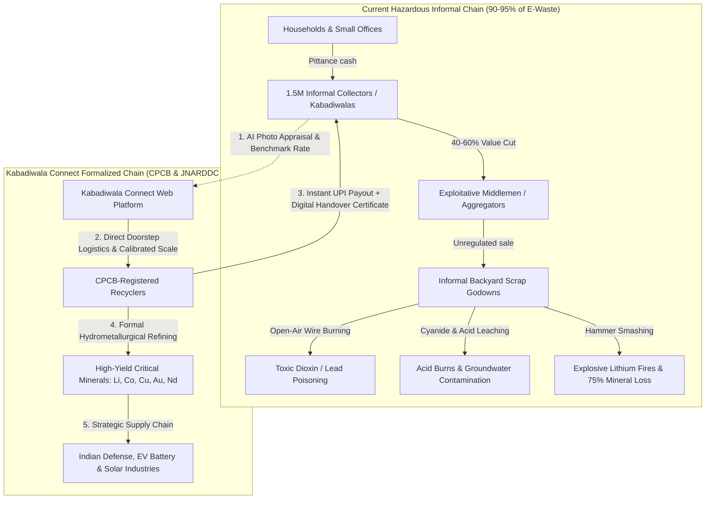
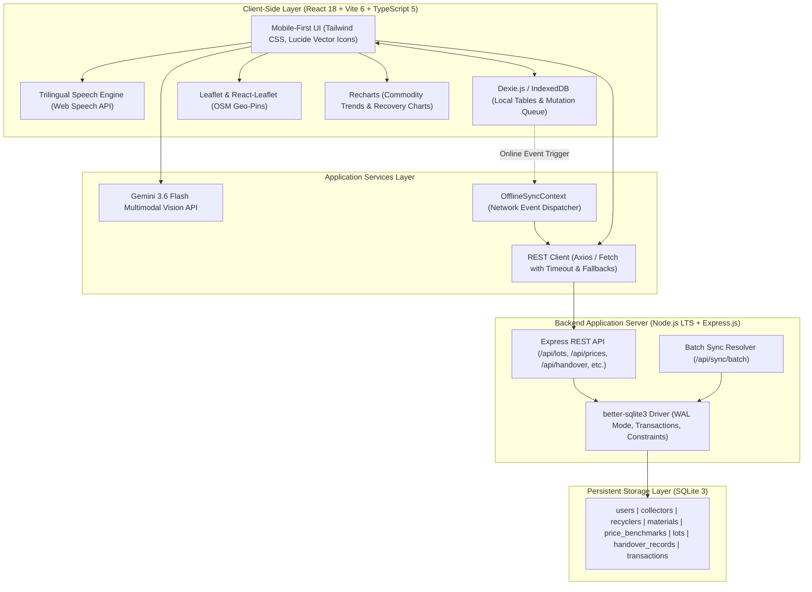
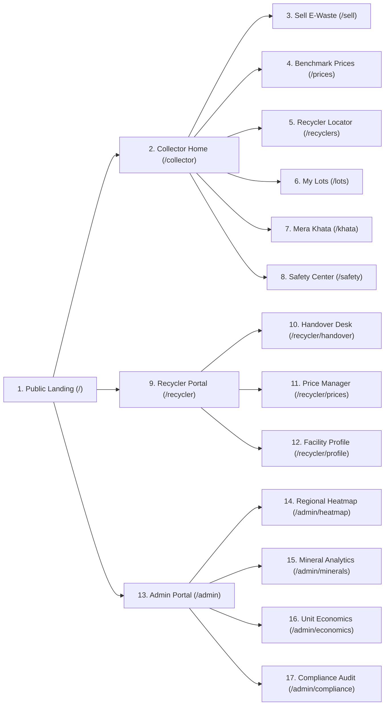

# KABADIWALA CONNECT — COMPLETE SYSTEM & ARCHITECTURAL DOCUMENTATION
### Smart India Hackathon 2026 | Problem Statement ID: 26229
**Issuing Authority**: Ministry of Mines (MoM) / Jawaharlal Nehru Aluminium Research Development and Design Centre (JNARDDC)  
**Problem Statement**: *"Kabadiwala Connect – Bringing the Informal Collector into the Formal Recycling Chain"*  
**Live Production URL**: [https://kabadiwala-connect-khaki.vercel.app](https://kabadiwala-connect-khaki.vercel.app)  
**GitHub Repository**: [https://github.com/Itsmeaadeesh/KABADI-VALA](https://github.com/Itsmeaadeesh/KABADI-VALA)  

---

## 1. Executive Summary & Problem Landscape

### 1.1 The National E-Waste Dilemma
India is the **third-largest producer of electronic waste globally**, generating over **3.2 million metric tonnes per annum** (growing at ~30% CAGR). Despite progressive regulations like the *E-Waste (Management) Rules, 2022* and mandatory Extended Producer Responsibility (EPR) frameworks, **over 90% to 95% of e-waste in India is collected, aggregated, and dismantled by the informal sector**.

This informal pyramid is anchored by an estimated **1.5 million grassroots informal scrap collectors (*kabadiwalas*)**, who walk door-to-door, commercial hubs, and scrap dumps. They feed into intermediary middlemen (*thekedars*), who in turn supply unorganized scrap godowns.



### 1.2 Systemic Failures in the Informal Paradigm
1. **Middleman Exploitation & Severe Information Asymmetry**:
   - Informal collectors lack chemical and metallurgical knowledge. A complex 4-layer server motherboard containing ₹600 worth of gold and copper is frequently bought by aggregators as "mixed junk" for ₹50–₹100.
   - Collectors routinely lose **40% to 60% of the intrinsic commodity value** of electronic components.
2. **Catastrophic Occupational Health & Environmental Hazards**:
   - **Open-Air Wire Burning**: Stripping PVC insulation over open fires releases carcinogenic dioxins, furans, and aerosolized lead directly into informal settlements (e.g., Dharavi, Seelampur, Mandoli).
   - **Cyanide & Nitric Acid Leaching**: Rudimentary recovery of gold and silver from PCB fingers using unventilated boiling acid baths causes irreversible respiratory fibrosis, chemical burns, and severe toxic discharge into municipal drains.
   - **Hammer Smashing of Batteries**: Puncturing lithium-ion cells with chisels and hammers results in catastrophic thermal runaways, volatile HF fumes, and blindings.
3. **Severe Drain of Strategic Critical Minerals**:
   - India imports over **95% of its Lithium, Cobalt, and Nickel**, and **100% of its Neodymium and Tantalum**.
   - Primitive informal extraction methods recover less than **20–25% of precious metals**, while dumping the rest into unlined landfills. Formal hydrometallurgical recycling achieves **>95% mineral recovery efficiency**.
4. **Financial Exclusion & Lack of Legal Identity**:
   - Kabadiwalas operate entirely in cash. They possess zero verifiable transaction records, preventing access to formal credit, banking facilities, insurance, or microfinance schemes (e.g., PM SVANidhi).

---

## 2. Platform Mission & Architectural Pillars

**Kabadiwala Connect** is a production-ready, civic-tech progressive web application designed to bridge informal e-waste collectors directly into India's formal, CPCB-certified circular economy.

```text
┌──────────────────────────────────────────────────────────────────────────────┐
│                       KABADIWALA CONNECT 7 CORE PILLARS                      │
├────────────────────────────────┬─────────────────────────────────────────────┤
│ 1. Low-Literacy Visual UX      │ Tactile cards, high-contrast, zero-emoji    │
│ 2. Multimodal AI Valuation     │ Google Gemini 3.6 Flash Vision component ID │
│ 3. Trilingual Voice Engine     │ Web Speech API: English, Hindi, Marathi     │
│ 4. Guaranteed Benchmarks       │ Ministry of Mines MSP benchmark price board │
│ 5. Offline-First Resilience    │ IndexedDB (Dexie.js) cache + auto-sync      │
│ 6. Calibrated 2-Party Scale    │ QR manifests, digital handover certificates │
│ 7. Verifiable Digital Khata    │ Official income passbook for bank credit    │
└────────────────────────────────┴─────────────────────────────────────────────┘
```

---

## 3. Technology Stack & System Architecture



### Full Technical Specifications:
* **Frontend Architecture**: Single Page Application built with React 18.3, TypeScript 5.7, and Vite 6.
* **Styling & UI Standard**: Tailwind CSS v3 with customized civic theme tokens (`brand-50` through `brand-950`), custom scrollbar utilities, safe-area inset handlers (`env(safe-area-inset-*)`), and strict vector SVG iconography (`lucide-react`).
* **Computer Vision AI**: Direct multimodal REST integration with Google Gemini 3.6 Flash API with strict JSON schema enforcement.
* **Offline Storage & Caching**: IndexedDB via Dexie.js with optimistic writes and idempotent synchronization queue.
* **Audio Accessibility**: Native browser `window.speechSynthesis` with speech synthesis rate compensation and localized lexicon for `hi-IN` (Hindi), `mr-IN` (Marathi), and `en-IN` (Indian English).
* **Geospatial Mapping**: Leaflet v1.9 + React-Leaflet with OpenStreetMap tiles, custom SVG pinpoint markers, and haversine distance calculations.
* **Data Visualization**: Recharts v2 (Area charts, Bar charts, Historical price timelines).
* **Backend Architecture**: Node.js v24 LTS + Express + TypeScript with JSON body parsing and CORS headers.
* **Relational Storage**: `better-sqlite3` configured with `journal_mode = WAL` (Write-Ahead Logging), busy timeouts, and cascading foreign keys.
* **Cloud & CDN**: Vercel Global Edge Network with custom route rewrites and security headers.

---

## 4. User Personas & Role-Based Workflows

The platform provides a unified global role switcher in the top bar to experience all three perspectives:

```text
┌─────────────────────────────────────────────────────────────────────────────┐
│                             USER PERSONAS                                   │
├──────────────────────────┬──────────────────────────┬───────────────────────┤
│ 1. COLLECTOR             │ 2. RECYCLER              │ 3. ADMIN / REGULATOR  │
│ Ramesh Kumar             │ Rajesh Sharma            │ Dr. S. K. Verma       │
│ Informal Scrap Picker    │ Operations Head          │ Director of Circulars │
│ Dharavi Cluster, Mumbai  │ GreenCycle Recyclers     │ JNARDDC / Min of Mines│
│ Target: Fair Cash & Safety│ Target: Verified Inflow  │ Target: Policy Impact │
└──────────────────────────┴──────────────────────────┴───────────────────────┘
```

### 4.1 Collector Journey: Ramesh Kumar (Dharavi)
1. **App Launch & Orientation**: Opens the PWA on an entry-level Android phone; interface auto-loads in Hindi (`हिंदी`). Taps the voice speaker button to hear audio greetings and instructions.
2. **Visual Appraisal**: Points phone camera at a collected motherboard. Gemini 3.6 Flash Vision identifies the board in 1.2 seconds, grades it as `High Grade Server PCB`, highlights critical minerals (Gold 250 g/t, Copper 22%), and gives audio hazard advice.
3. **Weight & Valuation**: Enters estimated weight (12.5 KG). Selects `Intact (+5% Quality Bonus)`. Platform calculates guaranteed minimum payout (₹5,381).
4. **Lot Generation**: Submits lot; system generates a tamper-evident digital manifest (`LOT-2026-MH-4821`).
5. **Logistics & Handover**: Selects nearest authorized facility (*GreenCycle Recyclers, Kurla*). Recycler truck arrives, weighs on calibrated scales, scans QR code, confirms 12.2 KG actual weight, and initiates immediate simulated UPI transfer.
6. **Passbook Credit**: Transaction instantly reflects in Ramesh's *Mera Khata* passbook, building bank-verified credit history.

### 4.2 Recycler Journey: Rajesh Sharma (GreenCycle)
1. **Incoming Queue Monitoring**: Reviews incoming lots and scheduled pickups from informal collectors across the Mumbai metropolitan area.
2. **Calibrated Scale Verification**: Opens the Digital Handover Desk (`/recycler/handover`). Enters the Lot code or scans collector's QR code.
3. **Reconciliation**: Enters exact weighbridge weight and inspects component condition.
4. **Instant Settlement & Certification**: Clicks Confirm; system generates an immutable CPCB Digital Handover Certificate with QR code and dispatches instant UPI payment.
5. **EPR Credit Generation**: Handover data automatically credits GreenCycle's CPCB EPR fulfillment quota.

### 4.3 Government Regulator Journey: Dr. S. K. Verma (JNARDDC / Ministry of Mines)
1. **National Oversight**: Views real-time dashboards showing 1,248 collectors formalized and 428.7 tonnes diverted from toxic dumps.
2. **Geospatial Intelligence**: Analyzes the Regional Heatmap across Maharashtra industrial corridors (Mumbai MMR, Pune, Nagpur, Nashik) to detect illegal informal dumping hotspots.
3. **Strategic Mineral Audits**: Monitors domestic recovery kilograms of Copper, Lithium, Cobalt, Neodymium, Gold, and Tantalum.
4. **Regulatory Auditing**: Verifies CPCB certifications, weighbridge calibration records, and payment integrity scores across all registered facilities.

---

## 5. Screen-by-Screen Detailed Functional Breakdown



### 5.1 Public Landing Page (`/`)
* **Global Navigation Header**:
  - Brand identity icon with Ministry of Mines and JNARDDC accreditation subtitle.
  - Interactive 3-role portal switcher (`Collector`, `Recycler`, `Admin`).
  - Network sync status indicator pill (`Synced` / `Offline`).
  - Language toggle button group (`English`, `हिंदी`, `मराठी`).
* **Hero Banner**:
  - Heading: *"From Kabadiwala to Circular Economy"*.
  - Dual Call-to-Action buttons: `Start Selling E-Waste` (leads to `/sell`) and `Find Authorized Recycler` (leads to `/recyclers`).
* **Three Value Pillars**:
  - *Fair Benchmark Rates*: Real-time commodity-linked pricing boards.
  - *Safe Handling & Health*: +5% intact bonus disincentivizing hazardous dismantling.
  - *Digital Traceability*: Verifiable CPCB manifests and digital passbook records.
* **4-Stage Circular Pipeline Visualization**:
  - Visual cards illustrating: `Informal Collector` ➔ `Certified Recycler` ➔ `Verified Handover` ➔ `Formal Refining`.
* **Direct Role Access Cards**: High-contrast entry cards for Collector, Recycler, and Government Admin.
* **Live Commodity Scrap Ticker**: Real-time streaming banner displaying current market buy rates.
* **Institutional Footer**: Formal Ministry of Mines disclaimers, quick links, and SIH PS 26229 compliance badge.

---

### 5.2 Collector Portal (`/collector`)

#### A. Collector Home (`/collector`)
* **Top Header & Greeting**:
  - Displays localized greeting: *"नमस्ते Ramesh"* / *"Welcome Ramesh"*.
  - Live GPS geo-tag: *"Dharavi Sector 3, Mumbai • Live GPS Active"*.
  - Audio speech button reading out greeting and guidance.
  - Current monthly earnings card (₹18,450) with 1-tap navigation to Khata.
* **Dominant Hero Action**:
  - Giant green touch card with camera icon: *"SELL E-WASTE • Sell safely & fairly • AI Valuation"*.
* **2x2 Quick Action Grid**:
  - **PRICE (दाम देखें)**: Today's benchmark scrap rates ➔ `/prices`.
  - **RECYCLER (रीसाइक्लर खोजें)**: Nearest CPCB-authorized facilities ➔ `/recyclers`.
  - **MY LOTS (मेरे लॉट)**: Real-time status of registered lots ➔ `/lots`.
  - **MY KHATA (मेरा खाता)**: Verifiable digital passbook ledger ➔ `/khata`.
* **Full-Width Safety & Health Alert**:
  - Dedicated safety card warning against burning wires and acid baths, and explaining the +5% Intact Bonus ➔ `/safety`.
* **Mobile Bottom Navigation (`CollectorBottomNav.tsx`)**:
  - Sticky 5-tab bar (*Home*, *Prices*, *Lots*, *Khata*, *Safety*) with safe-area bottom clearance (`.pb-collector-nav`).

#### B. 3-Step AI Sell E-Waste Wizard (`/sell`)
* **Step 1: Visual AI Classification**:
  - Camera capture or photo upload, plus 5 instant sample cards (*Server Motherboard*, *Copper Cables*, *Lithium Battery*, *Electric Motor*, *CRT Display*).
  - **Live Gemini 3.6 Flash Multimodal Analysis**:
    - Item identification in English, Hindi, and Marathi.
    - Confidence metric (e.g. 96%) and sub-grade classification.
    - Critical mineral recovery forecast (e.g. *Copper 22%, Gold 250 g/t, Silver 1,100 g/t*).
    - Health hazard warnings in trilingual cards.
* **Step 2: Category Verification**:
  - 10 benchmark material cards with distinct icons for quick confirmation.
* **Step 3: Weight, Condition & Valuation**:
  - Large numeric weight display in KG with stepper buttons (`-5`, `-1`, `+1`, `+5`) and slider.
  - Component Condition Toggle:
    - `Intact (+5% Quality Bonus)`
    - `Damaged (Standard Rate)`
    - `Stripped (Discounted Rate)`
  - Instant payout computation card with trilingual audio read-aloud.
  - Tamper-evident digital manifest generation (e.g., `LOT-2026-MH-4821`).

#### C. Live Benchmark Price Board (`/prices`)
* **10-Commodity Price Table**: Real-time per-KG rates, daily trend percentages, and material classifications.
* **Category Filter Pills**: Quick filter by *Circuit Boards*, *Cables*, *Batteries*, *Motors*.
* **30-Day Historical Trend Chart**: Recharts line chart comparing government benchmark vs. market high/low.
* **Audio Broadcast**: 1-tap voice read-aloud of current rates in the active language.

#### D. Recycler Locator & Logistics Dispatcher (`/recyclers`)
* **Dual Display Mode**: Segmented switch between **List View** and **Interactive Map**.
* **Leaflet GPS Map**: OpenStreetMap centered on Mumbai MMR with 8 custom-pinned CPCB facilities.
* **Proximity Filters**: Distance chips (`5 KM`, `10 KM`, `25 KM`, `All`).
* **Facility Cards**: License number, driving distance, rating, verified purchase rate, doorstep pickup status.
* **Pickup Booking Modal**:
  - Select pickup date and time slot (*Morning 10 AM–1 PM*, *Afternoon 2 PM–5 PM*).
  - Locks benchmark rate for **48 hours**.

#### E. Registered Manifests / My Lots (`/lots` & `/lots/:id`)
* **Status-Differentiated Lots List**: Color-coded badges: `New Draft`, `Pickup Scheduled`, `Saved Locally (Offline)`, `Verified & Paid`.
* **Lot Detail View (`/lots/:id`)**:
  - Full photo inspection.
  - Interactive Handover QR Code modal.
  - Progress timeline: *Created ➔ Recycler Assigned ➔ Scale Verified ➔ Payout Disbursed*.
  - Printable receipt generator.

#### F. Mera Khata Digital Passbook (`/khata`)
* **Financial Metric Cards**: Total earnings (₹18,450), pending payments (₹3,250), completed lots (17), in-transit lots (2).
* **Verifiable Ledger**: Detailed rows with timestamps, facility stamps, verified weights, and UPI reference IDs.
* **Official Income Statement Modal**:
  - Formal certificate formatted for bank managers and welfare officers.
  - Displays total tonnage diverted, transaction count, gross earnings, and loan readiness level (**Tier-2 Ready / PM SVANidhi Eligible**).
  - 1-click **Print** and **PDF Download**.

#### G. Safety & Occupational Health Center (`/safety`)
* **Prohibited Practices (DO NOTs)**: Open-air cable burning (dioxin/lead risk), cyanide acid baths (respiratory hazard), hammer smashing of batteries (thermal runaway hazard).
* **Standard Operating Procedures (DOs)**: Intact component preservation (+5% bonus), personal protective equipment (gloves, masks).

---

### 5.3 Recycler Portal (`/recycler`)

#### A. Recycler Dashboard Overview (`/recycler`)
* **KPI Metrics**: Total tonnage received (42.8 MT), pending pickups (6), daily payouts (₹1.48 Lakhs).
* **Incoming Manifests Table**: Collector names, declared weights, material types, and verification actions.

#### B. Scale Verification & Digital Handover Desk (`/recycler/handover`)
* **Manifest ID Lookup**: Input or scan Lot ID (e.g., `LOT-2026-MH-4821`).
* **Scale Weight Reconciliation**: Input actual weight recorded on calibrated scale (e.g., declared 12.5 KG vs. scale 12.2 KG).
* **Rate Adjustment**: Finalize agreed per-KG rate based on physical inspection.
* **Confirm Handover & Payment**:
  - Automatically records transaction and issues simulated UPI reference ID.
  - Generates official CPCB Digital Handover Certificate with verification QR code.
  - Updates collector's Khata passbook and national mineral registers.

#### C. Dynamic Price Manager (`/recycler/prices`)
* Allows facility managers to adjust offered purchase rates relative to government benchmarks to attract specific high-demand scrap streams.

#### D. Legal Facility Profile (`/recycler/profile`)
* Displays CPCB Authorization Certificate (`CPCB/E-WASTE/2023/MH-092`), SPCB consent to operate, annual handling capacity (25,000 MT/year), operating address, and authorized categories.

---

### 5.4 Admin Governance & Oversight Portal (`/admin`)

#### A. Executive Overview (`/admin`)
* **National Key Performance Indicators**:
  - **1,248** Informal Collectors Formalized
  - **428.7** Tonnes E-Waste Diverted from Landfills
  - **8,423** Verifiable Transactions Logged
  - **₹4.9 Lakhs** Direct Value Disbursed to Grassroots Collectors
  - **8** Active CPCB-Registered Facilities
* **Formalization Growth Curve**: Area chart tracking diverted volume growth across the past 6 months.
* **Scrap Material Breakdown**: Proportional distribution across PCBs, Copper Wires, Batteries, and Motors.

#### B. Regional Geospatial Heatmap (`/admin/heatmap`)
* Tracks e-waste flows across industrial corridors and technology centers:
  - **Mumbai MMR**: 142.5 Tonnes (78% formalization)
  - **Pune & PCMC**: 98.2 Tonnes (72% formalization)
  - **Nagpur (JNARDDC Center)**: 64.1 Tonnes (85% formalization)
  - **Nashik Industrial**: 38.6 Tonnes (64% formalization)
  - **Chhatrapati Sambhajinagar**: 26.4 Tonnes (59% formalization)
  - **National Pilot Corridors**: Delhi NCR, Bengaluru, Hyderabad.

#### C. Strategic Critical Mineral Analytics (`/admin/minerals`)
* Real-time recovery volume and strategic domestic value:
  - **Copper (Cu)**: 92.4 tonnes (Power Grid & Electrification)
  - **Lithium (Li)**: 4.8 tonnes (EV Battery Cells)
  - **Cobalt (Co)**: 1.7 tonnes (Energy Storage)
  - **Neodymium (Nd)**: 820 kg (Permanent Magnets for EVs & Wind Turbines)
  - **Gold (Au)**: 21.4 kg (Semiconductors & Defense Radar)
  - **Tantalum (Ta)**: 340 kg (Defense Electronics)
  - **Indium (In)**: 95 kg (Display Touch Panels & Solar Cells)

#### D. Unit Economics Simulator (`/admin/economics`)
* Side-by-side comparative financial model (100 KG E-Waste Lot):
  - **Informal Middleman Channel**: ₹4,200 net payout, 40% value loss, environmental damage, zero legal footprint.
  - **Kabadiwala Connect Formal Channel**: ₹5,775 net payout (**+37.5% net income increase**), verified scale weight, +5% intact bonus, zero collector fee, verified bank passbook record.

#### E. Recycler Compliance Audit (`/admin/compliance`)
* Real-time compliance monitoring: CPCB license status, EPR quota fulfillment percentage, weighbridge calibration validity, and payment integrity scores.

---

## 6. Gemini 3.6 Flash Vision AI Architecture

### 6.1 Inference Pipeline
```text
[ Photo Upload / Camera Capture ]
                │
                ▼
[ Client-Side Base64 Encoding ]
                │
                ▼
[ POST to Gemini 3.6 Flash REST API ]
  - Endpoint: https://generativelanguage.googleapis.com/v1beta/models/gemini-3.6-flash:generateContent
  - Headers: Content-Type: application/json
  - Authentication: Direct VITE_GEMINI_API_KEY
                │
                ▼
[ Structured JSON Schema Enforcement ]
  - responseMimeType: "application/json"
  - temperature: 0.2 (deterministic classification)
                │
                ▼
[ Schema Validation & Fallback Handling ]
  - Validates materialId, code, names (EN, HI, MR), confidence, minerals, hazards
  - Graceful fallback to internal preset samples if offline or rate-limited
```

### 6.2 Master System Prompt
```text
You are an expert E-Waste recycling AI for the Ministry of Mines (JNARDDC) under SIH Problem Statement 26229.
Analyze this photo carefully.
Identify the e-waste item, its composition, grade, critical minerals, and safe handling instructions.
Return ONLY a valid raw JSON object matching this schema:
{
  "materialId": "mat-pcb" | "mat-cable-cu" | "mat-bat-li" | "mat-motors" | "mat-crt-disp" | "mat-alu-heatsink" | "mat-general-ewaste",
  "code": "PCB" | "CABLE_CU" | "BAT_LI" | "MOTORS" | "CRT_DISP" | "ALU_HS" | "EWASTE_GEN",
  "name": string (English),
  "nameHi": string (Hindi Devanagari script),
  "nameMr": string (Marathi Devanagari script),
  "confidence": number (between 0.85 and 0.99),
  "subGrade": string (detailed technical grade description),
  "criticalMinerals": string[] (e.g. ["Copper (22%)", "Gold (250 g/t)", "Silver (1,100 g/t)"]),
  "hazardWarning": string (English),
  "hazardWarningHi": string (Hindi Devanagari),
  "hazardWarningMr": string (Marathi Devanagari),
  "suggestedCondition": "INTACT" | "DAMAGED" | "STRIPPED"
}
```

---

## 7. Offline-First Synchronization Architecture

```text
[ Offline State: Network Down ]
               │
               ▼
[ Collector Submits Lot / Pickup ]
               │
               ▼
[ Dexie.js (IndexedDB) Execution ]
  ├── 1. Optimistic Write: Record inserted into local `lots` table (status: 'SAVED_LOCALLY')
  ├── 2. Queue Mutation: Action enqueued in `syncQueue` with UUID & payload
  └── 3. UI Badge Updates: Displays amber "Saved Locally (Offline)" pill
               │
[ Network Reconnection Event: 'online' ]
               │
               ▼
[ OfflineSyncContext Handler ]
  ├── 1. Reads all pending items from `syncQueue` in chronological order
  ├── 2. Dispatches batch payload to POST /api/sync/batch
  ├── 3. Backend commits batch inside an atomic SQLite transaction
  ├── 4. Clears completed mutations from `syncQueue`
  └── 5. UI Badge Updates: Green "Synced" indicator with toast confirmation
```

---

## 8. Mobile Ergonomics & Anti-Clipping Overhaul

To guarantee a native mobile app feel across all viewports (from 360px budget Android devices to modern iPhones):
1. **Zero Horizontal Overflow**:
   - Configured in `index.css`: `overflow-x: hidden`, `width: 100%`, `max-width: 100vw`.
   - Global header collapses to icon buttons on small screens (<270px width footprint).
2. **Anti-Clipping Bottom Clearance (`.pb-collector-nav`)**:
   - Fixed CSS specificity issue where `.pb-safe` was overriding large padding values to 16px.
   - Configured `.pb-collector-nav` with `calc(7rem + env(safe-area-inset-bottom, 1rem)) !important`.
   - Guarantees 50px+ visible clearance between the bottom card and the fixed bottom navigation bar.
3. **Standardized Bottom Navigation**:
   - Clean 64px (`h-16`) height with centered icons and labels.
4. **Scrollable Viewport Modals**:
   - Equipped with `max-h-[90vh] overflow-y-auto pb-8 my-auto` so modal buttons are never clipped by mobile screen edges or browser URL bars.

---

## 9. Critical Mineral Recovery & Economics Model

### 9.1 JNARDDC Strategic Mineral Recovery Yields

| Scrap Component | Contained Critical Minerals | Recovery Yield / Tonne | Strategic Domestic Application |
| :--- | :--- | :--- | :--- |
| **High-Grade Motherboard PCBs** | Gold (Au), Copper (Cu), Tantalum (Ta), Silver (Ag) | ~250g Gold, ~220kg Copper, ~4kg Tantalum | Defense radar, semiconductors, power grid |
| **EV & Laptop Li-Ion Batteries** | Lithium (Li), Cobalt (Co), Nickel (Ni) | ~70kg Lithium, ~120kg Cobalt, ~150kg Nickel | Indigenous EV battery cells, energy storage |
| **Electric Motors & Alternators** | Copper (Cu), Neodymium (Nd), Dysprosium (Dy) | ~180kg Copper, ~3.5kg Neodymium | Wind turbines, electric propulsion, drones |
| **Telecom Base Station Boards** | Palladium (Pd), Platinum (Pt), Copper (Cu) | ~80g Palladium, ~30g Platinum, ~280kg Copper | 5G infrastructure, aerospace catalysts |
| **Display Screens & LCDs** | Indium (In), Tin (Sn) | ~250g Indium | Display touch panels, solar photovoltaic cells |

### 9.2 Economic Impact Comparison (100 KG Mixed Lot)

| Financial Element | Traditional Informal Channel | Kabadiwala Connect Formal Model |
| :--- | :--- | :--- |
| **Gross Commodity Value** | ₹5,000 | ₹5,500 |
| **Middleman Deduction** | -₹800 (16% value cut) | ₹0 deduction on collector |
| **Quality Sorting Premium** | ₹0 | +₹275 (+5% Intact Bonus) |
| **Net Collector Payout** | **₹4,200** | **₹5,775** |
| **Net Income Increase** | — | **+₹1,575 (+37.5% direct income gain)** |
| **Financial Identity** | Zero formal proof | Certified bank income passbook |

---

## 10. Database Schema (SQLite 3 WAL DDL)

```sql
-- 1. Users & Roles
CREATE TABLE users (
  id TEXT PRIMARY KEY,
  phone TEXT UNIQUE NOT NULL,
  name TEXT NOT NULL,
  role TEXT NOT NULL CHECK(role IN ('COLLECTOR', 'RECYCLER', 'ADMIN')),
  language TEXT DEFAULT 'en',
  created_at DATETIME DEFAULT CURRENT_TIMESTAMP
);

CREATE TABLE collectors (
  id TEXT PRIMARY KEY,
  user_id TEXT UNIQUE REFERENCES users(id),
  latitude REAL,
  longitude REAL,
  address TEXT,
  total_earnings REAL DEFAULT 0,
  lots_completed INTEGER DEFAULT 0,
  upi_id TEXT
);

CREATE TABLE recyclers (
  id TEXT PRIMARY KEY,
  user_id TEXT UNIQUE REFERENCES users(id),
  facility_name TEXT NOT NULL,
  cpcb_reg_number TEXT NOT NULL,
  latitude REAL NOT NULL,
  longitude REAL NOT NULL,
  address TEXT NOT NULL,
  service_radius INTEGER DEFAULT 25,
  pickup_available BOOLEAN DEFAULT 1,
  rating REAL DEFAULT 4.8,
  rates TEXT
);

-- 2. Materials & Commodity Benchmarks
CREATE TABLE materials (
  id TEXT PRIMARY KEY,
  code TEXT UNIQUE NOT NULL,
  name TEXT NOT NULL,
  name_hi TEXT,
  name_mr TEXT,
  category TEXT NOT NULL,
  base_rate REAL NOT NULL,
  unit TEXT DEFAULT 'KG',
  hazards TEXT,
  hazards_hi TEXT,
  hazards_mr TEXT,
  critical_minerals TEXT
);

CREATE TABLE price_benchmarks (
  id TEXT PRIMARY KEY,
  material_id TEXT REFERENCES materials(id),
  benchmark_rate REAL NOT NULL,
  trend_direction TEXT DEFAULT 'UP',
  trend_percentage REAL DEFAULT 0.0,
  updated_at DATETIME DEFAULT CURRENT_TIMESTAMP
);

CREATE TABLE price_history (
  id TEXT PRIMARY KEY,
  material_id TEXT REFERENCES materials(id),
  date TEXT NOT NULL,
  rate REAL NOT NULL
);

-- 3. Lots, Pickups, and Handover Receipts
CREATE TABLE lots (
  id TEXT PRIMARY KEY,
  code TEXT UNIQUE NOT NULL,
  collector_id TEXT REFERENCES collectors(id),
  material_id TEXT REFERENCES materials(id),
  weight REAL NOT NULL,
  condition TEXT DEFAULT 'INTACT',
  estimated_price REAL NOT NULL,
  final_price REAL,
  status TEXT DEFAULT 'NEW',
  photo_url TEXT,
  created_at DATETIME DEFAULT CURRENT_TIMESTAMP
);

CREATE TABLE pickup_requests (
  id TEXT PRIMARY KEY,
  lot_id TEXT REFERENCES lots(id),
  recycler_id TEXT REFERENCES recyclers(id),
  collector_id TEXT REFERENCES collectors(id),
  scheduled_slot TEXT,
  status TEXT DEFAULT 'REQUESTED',
  created_at DATETIME DEFAULT CURRENT_TIMESTAMP
);

CREATE TABLE handover_records (
  id TEXT PRIMARY KEY,
  lot_id TEXT UNIQUE REFERENCES lots(id),
  recycler_id TEXT REFERENCES recyclers(id),
  scale_weight REAL NOT NULL,
  rate_per_kg REAL NOT NULL,
  total_amount REAL NOT NULL,
  cpcb_certificate_id TEXT NOT NULL,
  verified_at DATETIME DEFAULT CURRENT_TIMESTAMP
);

CREATE TABLE transactions (
  id TEXT PRIMARY KEY,
  lot_id TEXT REFERENCES lots(id),
  collector_id TEXT REFERENCES collectors(id),
  recycler_id TEXT REFERENCES recyclers(id),
  amount REAL NOT NULL,
  reference_id TEXT NOT NULL,
  payment_method TEXT DEFAULT 'UPI',
  created_at DATETIME DEFAULT CURRENT_TIMESTAMP
);
```

---

## 11. REST API Endpoint Reference

| Method | Endpoint | Description | Request / Query | Sample Output |
| :--- | :--- | :--- | :--- | :--- |
| `GET` | `/api/health` | Service health check | None | `{"status":"ok","service":"Kabadiwala Connect API"}` |
| `GET` | `/api/materials` | List all 10 material categories | None | `[{"id":"mat-pcb","name":"Server Motherboard",...}]` |
| `GET` | `/api/prices` | Benchmark rates & trends | None | `[{"material_id":"mat-pcb","benchmark_rate":410,...}]` |
| `GET` | `/api/prices/history` | 30-day commodity price curve | `?materialId=mat-pcb` | `[{"date":"1 Sep","benchmark":395},...]` |
| `GET` | `/api/recyclers` | CPCB registered facilities | `?lat=19.04&lng=72.85` | `[{"facility_name":"GreenCycle","rating":4.8,...}]` |
| `GET` | `/api/lots` | Filter lots by collector/status | `?collectorId=col-ramesh-1` | `[{"code":"LOT-2026-MH-4821","weight":12.5,...}]` |
| `POST` | `/api/lots` | Create digital manifest | Payload: `{collectorId, materialId, weight}` | `{"id":"...","code":"LOT-2026-MH-4821",...}` |
| `GET` | `/api/lots/:id` | Detailed manifest breakdown | Path param `id` or `code` | `{"lot":{...},"timeline":[...]}` |
| `POST` | `/api/pickups` | Request doorstep pickup | Payload: `{lotId, recyclerId, scheduledSlot}` | `{"id":"pkp-...","status":"SCHEDULED"}` |
| `POST` | `/api/handover/verify` | Scale reconciliation & payout | Payload: `{lotCode, verifiedWeight, ratePerKg}` | `{"success":true,"transactionId":"txn-...",...}` |
| `GET` | `/api/transactions` | Collector earnings ledger | `?collectorId=col-ramesh-1` | `[{"amount":5185,"reference_id":"UPI-982173",...}]` |
| `GET` | `/api/analytics` | National KPIs & strategic minerals | None | `{"kpis":{...},"criticalMinerals":[...]}` |
| `GET` | `/api/safety` | Safety guidelines & flashcards | None | `[{"type":"DONT","title":"Never Burn Wires",...}]` |
| `POST` | `/api/sync/batch` | Flush offline IndexedDB queue | Payload: `{mutations:[...]}` | `{"success":true,"synced":3}` |

---

## 12. Local Development & Deployment Guide

### Local Setup
```bash
# 1. Clone repository
git clone https://github.com/Itsmeaadeesh/KABADI-VALA.git
cd KABADI-VALA

# 2. Setup and run Backend Server
cd server
npm install
npm run build
node dist/index.js

# 3. Setup and run Frontend Client (in a separate terminal)
cd ../client
npm install
# Configure client/.env: VITE_GEMINI_API_KEY=your_key_here
npm run dev
```

### Access Ports & URLs:
* **Frontend Web App**: `http://localhost:5174` (or `5173`)
* **Backend REST API**: `http://localhost:5001/api/health`
* **Live Production Cloud**: [https://kabadiwala-connect-khaki.vercel.app](https://kabadiwala-connect-khaki.vercel.app)
* **GitHub Repository**: [https://github.com/Itsmeaadeesh/KABADI-VALA](https://github.com/Itsmeaadeesh/KABADI-VALA)
