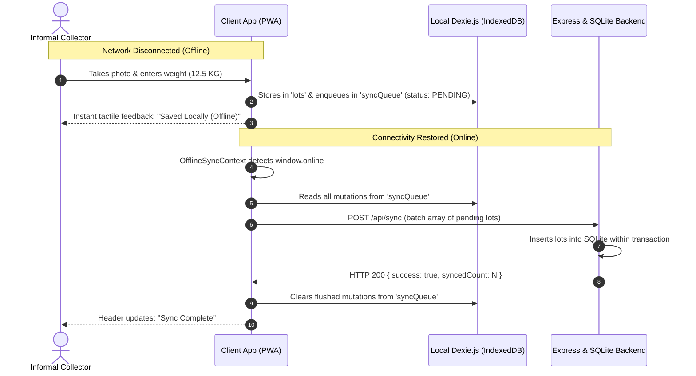

# KABADIWALA CONNECT — COMPLETE SYSTEM DOCUMENTATION
### Smart India Hackathon 2026 | Problem Statement ID: 26229
**Issued by**: Ministry of Mines (MoM) / Jawaharlal Nehru Aluminium Research Development and Design Centre (JNARDDC)  
**Problem Statement**: *"Kabadiwala Connect – Bringing the Informal Collector into the Formal Recycling Chain"*

---

## 1. Executive Summary & Vision

India generates over **3.2 million tonnes of e-waste annually**, ranking as the third-largest producer in the world. Over **90–95% of this waste is managed by the informal sector**—an estimated 1.5 million local scrap collectors (*kabadiwalas*) and dismantlers.

### The Core Problem:
1. **Middlemen Exploitation**: Informal collectors sell complex electronic components (printed circuit boards, lithium batteries) as generic iron or scrap, losing up to **40–60% of true value**.
2. **Severe Environmental & Health Hazards**: Informal dismantling relies on hazardous crude practices—open-air cable burning (releasing dioxins/furans), toxic cyanide/nitric acid baths for PCB gold recovery, and manual lead-acid battery cracking.
3. **Loss of Critical & Strategic Minerals**: Rare and high-value materials (Copper, Lithium, Cobalt, Neodymium, Tantalum, Gold, Indium) are discarded in landfills or poorly extracted with low recovery yields, jeopardizing national resource security.
4. **Lack of Legal & Financial Footprint**: Kabadiwalas lack legal CPCB documentation, formal bank credit, and identity in the national Extended Producer Responsibility (EPR) compliance framework.

### The Solution — Kabadiwala Connect:
A civic-tech circular economy ecosystem connecting the **Informal E-Waste Collector** directly to **CPCB-Authorized Recyclers** under **Ministry of Mines / JNARDDC** governance. The platform is designed with low-literacy ergonomics (vernacular voice, visual AI classification, tactile numeric steppers), guaranteed price transparency, offline-first data sync, 2-party digital scale verification, and national strategic mineral tracking.

---

## 2. System Architecture & Tech Stack

```
┌─────────────────────────────────────────────────────────────────────────────┐
│                             PRESENTATION LAYER                              │
│                                                                             │
│   [ Landing Page ]      [ Collector PWA ]     [ Recycler Scale ]  [ Admin ] │
│   Corporate Gateway     Low-Literacy Tactile   Verification Desk   Gov Portal│
│   Ref. Theme (#fcfdfc)  EN / HI / MR Voice     QR & UPI Receipt    JNARDDC  │
└──────────────────────┬────────────────────────────────┬─────────────────────┘
                       │                                │
                       ▼                                ▼
┌──────────────────────────────────────┐  ┌───────────────────────────────────┐
│           CLIENT SERVICES            │  │        OFFLINE RESILIENCE         │
│  • Web Speech API (Vernacular TTS)   │  │  • Dexie.js (IndexedDB Queue)     │
│  • AI Computer Vision Classifier     │  │  • Background Sync Flush          │
│  • Leaflet GIS Mapping Engine        │  │  • Network State Simulator        │
│  • Recharts Analytical Visualizer    │  │  • Optimistic UI Updates          │
└──────────────────────┬───────────────┘  └─────────────┬─────────────────────┘
                       │                                │
                       └───────────────┬────────────────┘
                                       │ REST / JSON (Vite Proxy :5174 -> :5001)
                                       ▼
┌─────────────────────────────────────────────────────────────────────────────┐
│                            APPLICATION LAYER                                │
│                         Express.js & TypeScript                             │
│                                                                             │
│  /api/auth       /api/materials   /api/prices     /api/lots   /api/recyclers│
│  /api/pickups    /api/handover    /api/transactions /api/analytics /api/sync│
└──────────────────────────────────────┬──────────────────────────────────────┘
                                       │ better-sqlite3 with Statement Cache
                                       ▼
┌─────────────────────────────────────────────────────────────────────────────┐
│                               DATABASE LAYER                                │
│                         SQLite (WAL Mode Enabled)                           │
│  10 Material Categories | 8 CPCB Recyclers | 30-Day Rate History | Ledgers   │
└─────────────────────────────────────────────────────────────────────────────┘
```

### Full Technology Matrix:
* **Frontend Framework**: React 18 with TypeScript, Vite build tool
* **Styling**: Tailwind CSS with custom civic emerald theme (`brand-50` through `brand-950`), custom scrollbars, and high-contrast accessibility
* **Iconography**: Clean vector SVG icons from `lucide-react` (100% zero-emoji corporate design)
* **Vernacular Voice**: Web Speech API (`SpeechSynthesis`) with dynamic phrasing in English, Hindi (`hi-IN`), and Marathi (`mr-IN`)
* **GIS Mapping**: Leaflet & React-Leaflet with OpenStreetMap cartography and customized GPS marker pins
* **Data Visualization**: Recharts (Responsive LineCharts, BarCharts, and Tooltips)
* **Local Storage & Offline Sync**: Dexie.js (IndexedDB) with optimistic mutations and automatic queue replay
* **Backend Runtime**: Node.js (v24 LTS compatible), Express.js, TypeScript
* **Database Driver**: `better-sqlite3` with SQLite Write-Ahead Logging (WAL mode), relational foreign keys, and statement caching
* **Security & Auth**: Role-based access simulation (Collector, Recycler, Admin) with phone OTP mock flow

---

## 3. Detailed Walkthrough of Every Page & View

### 3.1. Main Public Landing Page (`/`)
Built to match the enterprise circular economy design:
1. **Top Navbar**:
   * **Brand Identity**: Clean leaf/recycle icon with *"Kabadiwala Connect"* in bold typography.
   * **Navigation Links**: *Home*, *Marketplace*, *Recyclers*, *Resources*, *Community*, *About*.
   * **Vernacular Language Switcher**: One-tap toggle between **English**, **हिंदी**, and **मराठी**.
   * **Search Modal Trigger**: Instant search across 10 electronic materials, live scrap rates, and safety rules.
   * **Role-Based Log In Button**: Opens modal to sign in or instantly test as Collector, Recycler, or Admin.
2. **Hero Section**:
   * **Headline**: *"Turn Scrap Into Fair, Traceable Income"*.
   * **Subheadline**: *"Join Kabadiwala Connect to price, trace, and sell e-waste the formal way."*
   * **Pill Call-to-Action Buttons**:
     * `Start Collecting >`: Direct entrypoint to the informal collector mobile/desktop workflow.
     * `Find a Recycler`: Direct link to the registered recycler map.
   * **Trust Badges**: Three circular pastel badges—*Cleaner Communities*, *Fair Price For Scrap*, *Empowering Collectors*.
   * **High-Resolution Circular Economy Diagram**: Illustrating the lifecycle flow from waste generation to collector aggregation, CPCB refining, and critical mineral recovery.
   * **Trust Seal Tag**: Floating badge *"100% Traceable Chain • JNARDDC Benchmark"*.
3. **Live Benchmark Rate Ticker**:
   * Horizontal marquee streaming real-time rates from the database (e.g., *Copper Cable ₹520/KG ▲ 2.4%*, *Motherboard PCB ₹410/KG ▲ 1.8%*, *Li-Ion Battery ₹280/KG ▼ 0.7%*).
4. **Value Proposition Grid**:
   * **Fair Benchmark Pricing**: Direct tie-in to national scrap commodity benchmarks.
   * **Doorstep Recycler Logistics**: Verified recyclers pick up bulk lots directly from local scrap shops.
   * **Verifiable Digital Khata**: Legitimate financial footprint unlocking micro-loans and PM SVANidhi benefits.
   * **Critical Mineral Recovery**: Securing high-purity domestic minerals for India's strategic industries.
5. **Interactive Persona Showcase**:
   * Card tabs showcasing the experience for **Collector Ramesh**, **Recycler GreenCycle**, and **Admin JNARDDC**.
6. **Official Footer**:
   * Ministry of Mines and JNARDDC attribution, Quick Links, Compliance Declarations, and Problem Statement ID 26229 badge.

---

### 3.2. Global Evaluation Header (`DemoHeader.tsx`)
Present at the top of every internal view:
* **Hackathon Badge**: `SIH 2026 #26229 • Ministry of Mines / JNARDDC`.
* **3-Minute Jury Flow Button**: Launches the 20-step interactive presentation modal (`JuryTourModal.tsx`) with auto-jump shortcuts to each stage of the transaction lifecycle.
* **Role Switcher Toolbar**: One-click switching between:
  * `Collector (Ramesh)` -> Routes to `/collector`
  * `Recycler (GreenCycle)` -> Routes to `/recycler`
  * `Admin (JNARDDC)` -> Routes to `/admin`
* **Public Portal Button**: Returns immediately to the public landing page (`/`).
* **Offline Sync Simulator & Status Indicator**:
  * Real-time network status pill (`Online` / `Offline Sim`).
  * Clicking the button simulates a network disconnection (turning off network requests and forcing Dexie.js IndexedDB offline buffering). Clicking again restores connection and flushes pending mutations to the server.

---

### 3.3. Collector Experience (`/collector`, `/sell`, `/lots`, `/prices`, `/recyclers`, `/khata`, `/safety`)

#### A. Collector Home (`/collector`)
* **Welcome Banner**: Displays collector's name (Ramesh), localized greeting in selected language, GPS location (*Dharavi Sector 3, Mumbai • Live GPS Active*), and vernacular voice button.
* **Monthly Earnings Summary**: Real-time ticker showing current month's formal earnings (e.g. ₹28,450) with quick link to Mera Khata.
* **Tactile Action Grid** (Responsive 2-column desktop / 1-column mobile):
  1. **Sell E-Waste (Hero Card)**: Direct jump to the 3-step AI scrap valuation workflow with camera icon and AI badge.
  2. **Today's Price (Benchmark Rates)**: Live prices with trend indicators.
  3. **Find Recycler (Facility Map)**: GPS locator with distance and doorstep pickup filters.
  4. **Mera Khata (Passbook)**: Verified transaction history and bank statement export.
  5. **Safety Center (Health Rules)**: Prohibited crude methods and +5% Intact Bonus guidelines.

#### B. Sell E-Waste / Lot Creator (`/sell`)
* **Step 1: Visual AI Component Identification**:
  * Sample photo gallery (Motherboard PCB, Copper Cable, Li-Ion Battery, Electric Motor) or live camera/device upload.
  * Simulated computer vision inference returns:
    * Category Name & Sub-grade (e.g. *High Grade Server Motherboard*)
    * Confidence Score (e.g. *94%*)
    * Critical Mineral Yields (e.g. *Copper 22%, Gold 250g/t, Tantalum 0.4%*)
    * Specific Hazard Warning (e.g. *Never burn or use acid leaching. Toxic fumes cause severe respiratory damage.*)
* **Step 2: Weight & Condition Input**:
  * Low-literacy weight adjuster with large tactile stepper buttons (`[-5]`, `[-1]`, `[+1]`, `[+5]` KG) and numerical display.
  * Condition Selector:
    * **Intact (Certified)**: Grants **+5% Quality Bonus** on benchmark price.
    * **Damaged**: Standard benchmark rate.
    * **Stripped**: Discounted rate due to missing high-value chips/coils.
* **Step 3: Instant Live Valuation & Manifest Submission**:
  * Real-time calculation: `Weight × Benchmark Rate × Condition Multiplier = Estimated Payout`.
  * Vernacular voice readout reading the exact calculation aloud.
  * 1-Tap Manifest Creation: Generates unique digital manifest (e.g., `LOT-2026-MH-4821`), works 100% offline if disconnected.

#### C. Lot List & Digital Manifests (`/lots` and `/lots/:id`)
* **Queue View**: Lists all created lots with status chips:
  * `New Lot` (Draft / Pending)
  * `Pickup Scheduled` (Doorstep truck dispatched)
  * `Saved Locally` (Stored in IndexedDB pending network sync)
  * `Verified & Paid` (Completed transaction)
* **Detail View (`/lots/:id`)**:
  * High-resolution component image.
  * Verifiable QR manifest for scale scanning.
  * Timeline audit trail: *Created -> Recycler Matched -> Handover Verified -> Paid*.
  * Strategic mineral tags and printable digital receipt.

#### D. Live Price Board (`/prices`)
* **Commodity Ticker**: Real-time rates for all 10 material classes.
* **30-Day Price Trend Charts**: Interactive Recharts graph comparing historical daily fluctuations for PCBs, Copper, Batteries, and Motors.
* **Audio Rate Broadcast**: Speaker button reads out daily rates in Hindi, Marathi, or English.

#### E. Recycler Locator & Doorstep Logistics (`/recyclers`)
* **Leaflet GPS Map**: Interactive OpenStreetMap centered on Mumbai MMR with custom pins for all 8 CPCB-registered recycling facilities.
* **Filter Chips**: 5 KM, 10 KM, 25 KM, All Distances.
* **Facility Cards**: Displaying business name, CPCB license number, distance, rating, verified rate for selected material, and doorstep pickup availability.
* **Pickup Request Modal**: Select time slot (*Morning 10 AM - 1 PM*, *Afternoon 2 PM - 5 PM*, *Evening 5 PM - 8 PM*), locking the benchmark rate for **48 hours**.

#### F. Mera Khata / Verifiable Digital Passbook (`/khata`)
* **Earnings Overview**: Total monthly income, verified transactions count, and pending payments.
* **Verified Ledger**: Detailed chronological list of payments with unique reference codes (`Ref: UPI-982173`), weights, and facility names.
* **Official Income Statement Modal**: Generates a tamper-evident, stamped official income summary formatted for microfinance institutions and government loan schemes (PM SVANidhi).

#### G. Safety & Health Center (`/safety`)
* **Prohibited Practices (Hazards)**:
  * *Open Wire Burning*: Lead and dioxin emission risks.
  * *Cyanide / Acid Bath Leaching*: Severe lung burns and toxic chemical waste.
  * *Hammer Smashing*: Toxic lithium fire risks and shattered chip loss.
* **Recommended Protocols (Incentives)**:
  * *Intact Handover*: +5% financial bonus for undamaged components.
  * *Protective Gear*: Gloves and masks for heavy electrical motors.

---

### 3.4. Recycler Logistics & Scale Verification Desk (`/recycler`)

#### A. Facility Dashboard (`/recycler`)
* **Executive Stats**: Total tonnage received, active pickups in transit, and verified collector payouts.
* **Incoming Queue**: Table of incoming digital manifests awaiting doorstep collection or physical scale verification.

#### B. Physical Scale Verification Desk (`/recycler/handover`)
* **Manifest Lookup / Scanner**: Enter or scan incoming lot QR code (e.g. `LOT-2026-MH-4821`).
* **Scale Verification Weight Input**: Recycler inputs calibrated weighbridge/scale weight (e.g. `12.2 KG` vs collector's estimated `12.5 KG`).
* **Quality Grade Adjustment**: Confirm intact status or adjust condition.
* **Payout Calculation**: System re-evaluates final payout using locked benchmark rate.
* **Digital Certificate & Instant Payment**:
  * Generates CPCB Handover Certificate with serial registration.
  * Records instant UPI payment transaction reference (`UPI-982173`).
  * Immediately updates collector's Mera Khata and national mineral analytics.

#### C. Price Manager (`/recycler/prices`)
* Recyclers can adjust offered purchase rates relative to government benchmarks to attract specific high-demand materials (e.g., offering +₹20/kg for High-Grade Server PCBs).

#### D. Legal Profile (`/recycler/profile`)
* Displays CPCB Authorization Certificate, SPCB registration, annual capacity (25,000 MT/year), address, and accepted e-waste categories.

---

### 3.5. Ministry of Mines / JNARDDC Governance Portal (`/admin`)

#### A. Executive Command Overview (`/admin`)
* **National Key Performance Indicators (KPIs)**:
  * **1,248** Collectors Formalized
  * **428.7** Tonnes E-Waste Diverted from Dumpsites
  * **8,423** Tamper-Evident Transactions Recorded
  * **₹4.9 Lakhs** Direct Value Disbursed to Informal Sector
  * **8** CPCB Authorized Facilities Active
* **Monthly Formalization Trends**: Interactive Recharts area chart tracking tonnage diverted over the past 6 months.
* **Material Composition Breakdown**: Distribution between PCBs, Copper Wires, Batteries, and Motors.

#### B. Regional Geospatial Flow Heatmap (`/admin/heatmap`)
* Visualizes formalization rates across Maharashtra districts and national technology hubs:
  * **Mumbai MMR**: 142.5 T (78% formalization)
  * **Pune & PCMC**: 98.2 T (72% formalization)
  * **Nagpur (JNARDDC Center)**: 64.1 T (85% formalization)
  * **Nashik Industrial**: 38.6 T (64% formalization)
  * **Chhatrapati Sambhajinagar**: 26.4 T (59% formalization)
  * **Delhi NCR, Bengaluru, Hyderabad**: National pilot corridors.

#### C. Critical Mineral Analytics (`/admin/minerals`)
* Tracks recovery volume and strategic domestic value for national security:
  * **Copper (Cu)**: 92.4 tonnes (Strategic Base Metal)
  * **Lithium (Li)**: 4.8 tonnes (EV Battery Critical)
  * **Cobalt (Co)**: 1.7 tonnes (Energy Transition Critical)
  * **Neodymium (Nd)**: 820 kg (Rare Earth Permanent Magnets)
  * **Gold (Au)**: 21.4 kg (Precious Technology Metal)
  * **Tantalum (Ta)**: 340 kg (Defense Electronics)
  * **Indium (In)**: 95 kg (Display Glass & Semiconductors)

#### D. Unit Economics Engine (`/admin/economics`)
* Side-by-side comparative simulation:
  * **Informal Middlemen Channel**: ₹3,800 payout, 40% weight loss, environmental contamination, zero legal proof.
  * **Kabadiwala Connect Formal Channel**: ₹5,185 payout (+36% higher income), verified scale weight, +5% intact bonus, zero platform fee on collector, and official bank statement record.

#### E. Recycler Compliance Audit (`/admin/compliance`)
* Audit table monitoring recycling plants: CPCB license status, EPR target fulfillment percentage, scale calibration validity, and payment integrity scores.

---

## 4. Complete Database Schema & Seed Data

The database is built on **SQLite with Write-Ahead Logging (WAL)**:

```sql
-- 1. Users & Profiles
CREATE TABLE users (
  id TEXT PRIMARY KEY,
  phone TEXT UNIQUE NOT NULL,
  name TEXT NOT NULL,
  role TEXT NOT NULL CHECK(role IN ('COLLECTOR', 'RECYCLER', 'ADMIN')),
  language TEXT DEFAULT 'en',
  created_at DATETIME DEFAULT CURRENT_TIMESTAMP
);

CREATE TABLE collectors (
  id TEXT PRIMARY KEY,
  user_id TEXT UNIQUE REFERENCES users(id),
  latitude REAL,
  longitude REAL,
  address TEXT,
  total_earnings REAL DEFAULT 0,
  lots_completed INTEGER DEFAULT 0,
  upi_id TEXT
);

CREATE TABLE recyclers (
  id TEXT PRIMARY KEY,
  user_id TEXT UNIQUE REFERENCES users(id),
  facility_name TEXT NOT NULL,
  cpcb_reg_number TEXT NOT NULL,
  latitude REAL NOT NULL,
  longitude REAL NOT NULL,
  address TEXT NOT NULL,
  service_radius INTEGER DEFAULT 25,
  pickup_available BOOLEAN DEFAULT 1,
  rating REAL DEFAULT 4.8,
  rates TEXT -- JSON string of material-specific purchase rates
);

-- 2. Materials & Live Commodity Benchmarks
CREATE TABLE materials (
  id TEXT PRIMARY KEY,
  code TEXT UNIQUE NOT NULL,
  name TEXT NOT NULL,
  name_hi TEXT,
  name_mr TEXT,
  category TEXT NOT NULL,
  base_rate REAL NOT NULL,
  unit TEXT DEFAULT 'KG',
  hazards TEXT,
  hazards_hi TEXT,
  hazards_mr TEXT,
  critical_minerals TEXT -- JSON array of contained strategic minerals
);

CREATE TABLE price_benchmarks (
  id TEXT PRIMARY KEY,
  material_id TEXT REFERENCES materials(id),
  benchmark_rate REAL NOT NULL,
  trend_direction TEXT DEFAULT 'UP',
  trend_percentage REAL DEFAULT 0.0,
  updated_at DATETIME DEFAULT CURRENT_TIMESTAMP
);

CREATE TABLE price_history (
  id TEXT PRIMARY KEY,
  material_id TEXT REFERENCES materials(id),
  date TEXT NOT NULL,
  rate REAL NOT NULL
);

-- 3. Lots, Pickups, and Handover Receipts
CREATE TABLE lots (
  id TEXT PRIMARY KEY,
  code TEXT UNIQUE NOT NULL,
  collector_id TEXT REFERENCES collectors(id),
  material_id TEXT REFERENCES materials(id),
  weight REAL NOT NULL,
  condition TEXT DEFAULT 'INTACT',
  estimated_price REAL NOT NULL,
  final_price REAL,
  status TEXT DEFAULT 'NEW',
  photo_url TEXT,
  created_at DATETIME DEFAULT CURRENT_TIMESTAMP
);

CREATE TABLE pickup_requests (
  id TEXT PRIMARY KEY,
  lot_id TEXT REFERENCES lots(id),
  recycler_id TEXT REFERENCES recyclers(id),
  collector_id TEXT REFERENCES collectors(id),
  scheduled_slot TEXT,
  status TEXT DEFAULT 'REQUESTED',
  created_at DATETIME DEFAULT CURRENT_TIMESTAMP
);

CREATE TABLE handover_records (
  id TEXT PRIMARY KEY,
  lot_id TEXT UNIQUE REFERENCES lots(id),
  recycler_id TEXT REFERENCES recyclers(id),
  scale_weight REAL NOT NULL,
  rate_per_kg REAL NOT NULL,
  total_amount REAL NOT NULL,
  cpcb_certificate_id TEXT NOT NULL,
  verified_at DATETIME DEFAULT CURRENT_TIMESTAMP
);

CREATE TABLE transactions (
  id TEXT PRIMARY KEY,
  lot_id TEXT REFERENCES lots(id),
  collector_id TEXT REFERENCES collectors(id),
  recycler_id TEXT REFERENCES recyclers(id),
  amount REAL NOT NULL,
  reference_id TEXT NOT NULL,
  payment_method TEXT DEFAULT 'UPI',
  created_at DATETIME DEFAULT CURRENT_TIMESTAMP
);

CREATE TABLE safety_guidelines (
  id TEXT PRIMARY KEY,
  type TEXT CHECK(type IN ('DONT', 'DO')),
  title TEXT NOT NULL,
  title_hi TEXT,
  title_mr TEXT,
  description TEXT NOT NULL,
  description_hi TEXT,
  description_mr TEXT,
  icon TEXT
);
```

### Seeded Materials:
1. **Server Motherboard (High Grade PCB)** — ₹410/kg (Contains Copper, Gold, Tantalum)
2. **Copper Insulated Wire / Cable** — ₹520/kg (Contains Copper 99% pure)
3. **Lithium-Ion Battery Pack (EV/Laptops)** — ₹280/kg (Contains Lithium, Cobalt, Nickel)
4. **Electric Motor / Alternator** — ₹185/kg (Contains Copper windings, Neodymium magnets)
5. **Mobile Phone Circuit Board** — ₹850/kg (Contains Gold, Silver, Palladium, Tantalum)
6. **Lead-Acid Inverter Battery** — ₹95/kg (Hazardous Lead / Acid)
7. **Computer Power Supply (SMPS)** — ₹120/kg (Contains Copper, Aluminum, Ferrite)
8. **Telecom Base Station PCB** — ₹650/kg (Contains Platinum group metals, Silver)
9. **Display Glass & LCD Panels** — ₹45/kg (Contains Indium Tin Oxide)
10. **Mixed Consumer Electronics** — ₹85/kg (General sorting baseline)

### Seeded CPCB Recyclers:
1. **GreenCycle E-Waste Recyclers Pvt Ltd** (Turbhe MIDC, Navi Mumbai) — CPCB: `MH/CPCB/EW/2024/0912`
2. **E-Parisaraa Recycling Unit** (Bhiwandi Logistics Hub, Thane) — CPCB: `MH/CPCB/EW/2023/0411`
3. **Maharashtra Eco-Refiners** (Bhosari MIDC, Pune) — CPCB: `MH/CPCB/EW/2024/1108`
4. **JNARDDC Pilot E-Waste Extraction Facility** (Amravati Road, Nagpur) — CPCB: `MH/CPCB/EW/2025/001`
5. **Eco-Birdd Recycling Solutions** (Ambad Industrial Estate, Nashik) — CPCB: `MH/CPCB/EW/2023/0842`
6. **Marathwada Resource Recovery** (Waluj MIDC, Chhatrapati Sambhajinagar) — CPCB: `MH/CPCB/EW/2024/0521`
7. **Attero Recycling** (Roorkee / National North Hub) — CPCB: `UA/CPCB/EW/2022/0101`
8. **Hulladek Recycling** (Eastern Region Network) — CPCB: `WB/CPCB/EW/2023/0290`

---

## 5. Complete REST API Reference

| Method | Endpoint | Description | Request / Query Params | Sample Response |
| :--- | :--- | :--- | :--- | :--- |
| `GET` | `/api/health` | Service health status | None | `{"status":"ok","service":"Kabadiwala Connect API","version":"1.0.0"}` |
| `POST` | `/api/auth/login` | Mock phone + OTP login | `{"phone":"9999999999","role":"COLLECTOR"}` | `{"token":"mock-jwt","user":{...},"profile":{...}}` |
| `GET` | `/api/materials` | Retrieve all 10 scrap categories | None | `[{"id":"mat-pcb-high","name":"Server Motherboard",...}]` |
| `GET` | `/api/prices` | Benchmark prices & trends | None | `[{"material_id":"mat-pcb-high","benchmark_rate":410,...}]` |
| `GET` | `/api/prices/history` | 30-day price trend history | `?materialId=mat-pcb-high` | `[{"date":"2026-08-12","rate":395},...]` |
| `GET` | `/api/recyclers` | CPCB registered recyclers | `?lat=19.07&lng=72.87&maxDistance=25` | `[{"facility_name":"GreenCycle", "distanceKm":4.2,...}]` |
| `GET` | `/api/lots` | Filter lots by collector/status | `?collectorId=col-ramesh-1` | `[{"code":"LOT-2026-MH-4821","weight":12.5,...}]` |
| `POST` | `/api/lots` | Create new digital manifest | `{"collectorId":"...","materialId":"...","weight":12.5}` | `{"id":"...","code":"LOT-2026-MH-4821",...}` |
| `GET` | `/api/lots/:id` | Detailed manifest breakdown | Path param `id` or `code` | `{"lot":{...},"timeline":[...],"handover":{...}}` |
| `POST` | `/api/pickups` | Request doorstep pickup | `{"lotId":"...","recyclerId":"...","scheduledSlot":"..."}` | `{"id":"pck-...", "status":"REQUESTED"}` |
| `POST` | `/api/handover/verify` | Physical scale verification | `{"lotId":"...","scaleWeight":12.2,"ratePerKg":425}` | `{"handover":{...},"transaction":{...}}` |
| `GET` | `/api/transactions` | Collector earnings ledger | `?collectorId=col-ramesh-1` | `[{"amount":5185,"reference_id":"UPI-982173",...}]` |
| `GET` | `/api/analytics` | National KPIs & strategic minerals | None | `{"kpis":{...},"criticalMinerals":[...],"regionalData":[...]}` |
| `GET` | `/api/safety` | Handling guidelines | None | `[{"type":"DONT","title":"Never Burn Wires",...}]` |
| `POST` | `/api/sync` | Batch flush offline mutations | `{"mutations":[...]}` | `{"success":true,"syncedCount":3}` |

---

## 6. Offline-First Synchronization Architecture

Informal scrap collection often takes place in basement godowns, dense industrial scrap clusters, and semi-rural areas with zero or unstable connectivity.



---

## 7. Strategic Mineral Yield & Economics Model

JNARDDC baseline laboratory models establish the following critical mineral recovery yields per metric tonne of separated scrap:

| Scrap Material | Primary Target Minerals | Average Recovery Yield per Tonne | Strategic Domestic Application |
| :--- | :--- | :--- | :--- |
| **High-Grade Motherboard PCBs** | Gold (Au), Copper (Cu), Tantalum (Ta), Silver (Ag) | ~250g Gold, ~220kg Copper, ~4kg Tantalum | Defense radar, semiconductors, power grid |
| **EV & Laptop Li-Ion Batteries** | Lithium (Li), Cobalt (Co), Nickel (Ni) | ~70kg Lithium, ~120kg Cobalt, ~150kg Nickel | Indigenous EV battery cells, energy storage |
| **Electric Motors & Alternators** | Copper (Cu), Neodymium (Nd), Dysprosium (Dy) | ~180kg Copper, ~3.5kg Neodymium | Wind turbines, electric propulsion, drones |
| **Telecom Base Station Boards** | Palladium (Pd), Platinum (Pt), Copper (Cu) | ~80g Palladium, ~30g Platinum, ~280kg Copper | 5G infrastructure, aerospace catalysts |
| **Display Screens & LCDs** | Indium (In), Tin (Sn) | ~250g Indium | Display touch panels, solar photovoltaic cells |

### Economic Impact for the Informal Collector:
* Under the traditional informal scrap model, 1 tonne of mixed e-waste yields an average of **₹28,000 – ₹35,000** to the collector due to arbitrary weight deductions and ignorance of mineral grades.
* Under the **Kabadiwala Connect** model, pre-sorted components with verified scale weighing and CPCB transparent rates yield **₹46,000 – ₹54,000 per tonne**—a direct **35% to 50% increase in grassroots income**.

---

## 8. Verification & Running Instructions

### Prerequisites:
* Node.js v18+ (tested and verified on Node.js v24.19.0)
* npm

### Running the Full Application:
```bash
# 1. Start Backend Server (runs on port 5001)
cd server
npm install
npm run build
node dist/index.js

# 2. Start Frontend Client (runs on port 5174 with API proxy)
cd client
npm install
npm run dev
```

### Access URLs:
* **Public Web Application**: `http://localhost:5174/`
* **Collector Portal**: `http://localhost:5174/collector`
* **Recycler Portal**: `http://localhost:5174/recycler`
* **Admin Governance Portal**: `http://localhost:5174/admin`
* **Backend API Health Check**: `http://localhost:5001/api/health`
