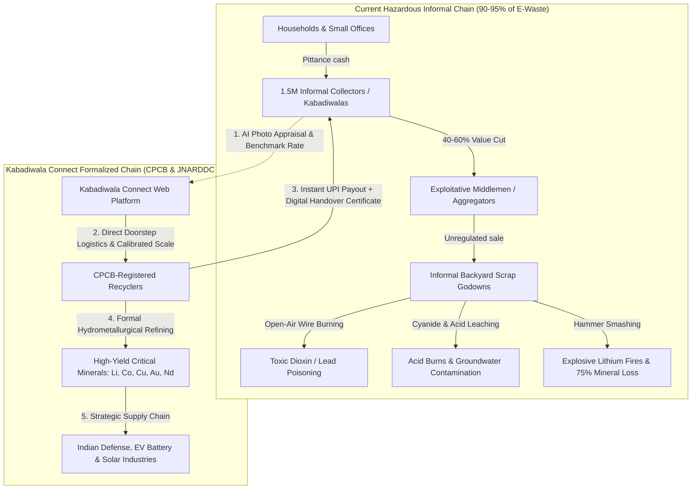
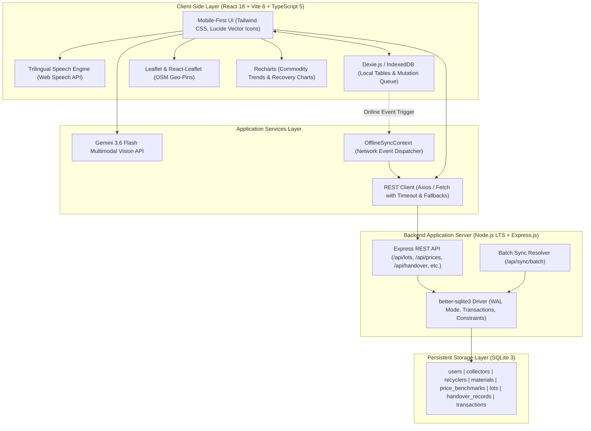
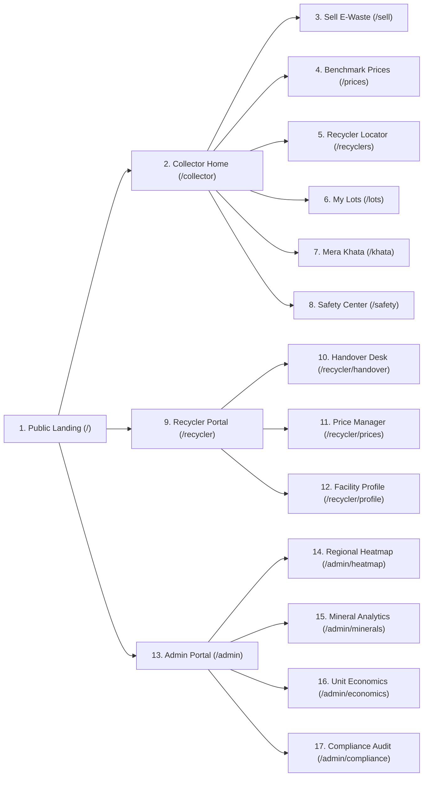

# KABADIWALA CONNECT (कबाड़ीवाला कनेक्ट)
> **“From Kabadiwala to Circular Economy — Bringing the Informal Collector into the Formal Recycling Chain”**

[](https://kabadiwala-connect-khaki.vercel.app)
[](https://www.sih.gov.in)
[](https://mines.gov.in)
[](#3-technology-stack--architecture)

* **Problem Statement ID**: `26229` (Smart India Hackathon 2026)
* **Issuing Authority**: Ministry of Mines (MoM) / Jawaharlal Nehru Aluminium Research Development and Design Centre (JNARDDC)
* **Live Production Web App**: [https://kabadiwala-connect-khaki.vercel.app](https://kabadiwala-connect-khaki.vercel.app)
* **GitHub Repository**: [https://github.com/Itsmeaadeesh/KABADI-VALA](https://github.com/Itsmeaadeesh/KABADI-VALA)

---

## 1. Project Overview & The National Challenge

India produces over **3.2 million tonnes of electronic waste annually**, ranking as the third-largest producer in the world. However, **more than 90–95% of this waste flows through the informal sector**—an estimated network of **1.5 million grassroots scrap collectors (*kabadiwalas*)** and unorganized godowns.



### Systemic Failures in the Informal Sector:
1. **Middlemen Exploitation & Information Asymmetry**: Informal collectors sell complex electronic components (such as server motherboards, multi-layer PCBs, and lithium batteries) as generic scrap, losing **40% to 60% of true intrinsic value**.
2. **Severe Health & Environmental Degradation**:
   - *Open-air cable burning* releasing cancer-causing dioxins, furans, and lead particles.
   - *Cyanide and nitric acid baths* for rudimentary gold leaching, causing acid burns, toxic fumes, and groundwater contamination.
   - *Hammer smashing of lithium-ion cells*, leading to volatile fires and thermal runaways.
3. **Loss of Strategic Critical Minerals**: Rare and high-value materials essential to national security and green energy (**Copper, Lithium, Cobalt, Neodymium, Tantalum, Gold, Indium**) are lost in landfills or recovered with sub-25% extraction efficiency.
4. **Zero Legal & Financial Identity**: Kabadiwalas operate entirely in cash off-the-books, possessing no CPCB compliance proof, no transaction records, and zero access to formal credit (e.g. PM SVANidhi).

---

## 2. Core Solution: The 7 Pillars of Kabadiwala Connect

```text
┌──────────────────────────────────────────────────────────────────────────────┐
│                       KABADIWALA CONNECT 7 CORE PILLARS                      │
├────────────────────────────────┬─────────────────────────────────────────────┤
│ 1. Low-Literacy Visual UX      │ Tactile cards, high-contrast, zero-emoji    │
│ 2. Multimodal AI Valuation     │ Google Gemini 3.6 Flash Vision component ID │
│ 3. Trilingual Voice Engine     │ Web Speech API: English, Hindi, Marathi     │
│ 4. Guaranteed Benchmarks       │ Ministry of Mines MSP benchmark price board │
│ 5. Offline-First Resilience    │ IndexedDB (Dexie.js) cache + auto-sync      │
│ 6. Calibrated 2-Party Scale    │ QR manifests, digital handover certificates │
│ 7. Verifiable Digital Khata    │ Official income passbook for bank credit    │
└────────────────────────────────┴─────────────────────────────────────────────┘
```

---

## 3. Technology Stack & Architecture



* **Frontend Framework**: React 18.3, Vite 6, TypeScript 5.7.
* **Design & Styling**: Tailwind CSS v3 with civic palette tokens, safe-area insets (`env(safe-area-inset-*)`), and zero emojis (100% vector SVG icons via `lucide-react`).
* **Computer Vision AI**: Direct multimodal REST API calls to **Google Gemini 3.6 Flash** with structured JSON output schema enforcement.
* **Offline-First Storage**: IndexedDB via **Dexie.js** with optimistic local writes and idempotent background sync queue.
* **Vernacular Audio**: Browser `window.speechSynthesis` with speech rate tuning for Hindi (`hi-IN`), Marathi (`mr-IN`), and Indian English (`en-IN`).
* **GIS Mapping**: Leaflet v1.9 + React-Leaflet with OpenStreetMap tiles and custom GPS facility markers.
* **Data Visualization**: Recharts v2 (Area charts, Bar charts, Historical price timelines).
* **Backend Runtime**: Node.js v24 LTS, Express.js, TypeScript.
* **Database**: `better-sqlite3` with Write-Ahead Logging (WAL mode), cascade constraints, and prepared statements.
* **Deployment & CDN**: Vercel Global Edge Network with instant cache-busting.

---

## 4. User Personas & 1-Click Role Switcher

The live application features a top-level **Role Switcher** for testing all user journeys:

| Role | Person / Organization | Context | Default Screen |
| :--- | :--- | :--- | :--- |
| **Collector** | **Ramesh Kumar** | Informal E-Waste Picker, Dharavi, Mumbai | `/collector` |
| **Recycler** | **Rajesh Sharma** | Operations Manager, GreenCycle Recyclers (CPCB Approved) | `/recycler` |
| **Admin** | **Dr. S. K. Verma** | Director of Circular Economy, JNARDDC / Ministry of Mines | `/admin` |

---

## 5. Screen-by-Screen Functional Walkthrough



### 5.1 Public Portal (`/`)
* **Global Navigation Header**: Language toggle (**EN**, **हिंदी**, **मराठी**), sync indicator (`Synced` / `Offline`), and 1-click role switcher.
* **Hero Section**: Civic-tech banner with dual CTAs (`Start Selling E-Waste` & `Find Authorized Recycler`).
* **Circular Pipeline Cards**: 4-step formal journey: *Informal Collector ➔ Certified Recycler ➔ Verified Handover ➔ Formal Refining*.
* **Live Scrap Ticker**: Real-time ticker streaming current per-KG buy rates for PCBs, Copper Wires, Batteries, and Motors.

### 5.2 Collector Portal (`/collector`)
* **Collector Home (`/collector`)**:
  - Personalized greeting with live GPS tag (*Dharavi Sector 3, Mumbai*).
  - Audio speech button reading out greeting and guidance.
  - Dominant `SELL E-WASTE` touch card with AI camera badge.
  - 2x2 action grid: `PRICE`, `RECYCLER`, `MY LOTS`, `MY KHATA`.
  - Anti-clipping bottom navigation clearance (`.pb-collector-nav`).
* **3-Step AI Lot Creator (`/sell`)**:
  - **Step 1: Visual AI Classification**: Upload photo or use camera; Gemini 3.6 Flash identifies component, confidence, sub-grade, critical minerals (Gold, Copper, Lithium), and hazard warnings.
  - **Step 2: Category Confirmation**: 10 benchmark material cards with icon indicators.
  - **Step 3: Weight, Condition & Valuation**: Tactile stepper buttons (`-5`, `-1`, `+1`, `+5 KG`), condition selector (`Intact +5% Bonus`, `Damaged`, `Stripped`), instant payout calculation, and trilingual voice read-aloud.
* **Live Benchmark Price Board (`/prices`)**:
  - 10-commodity price sheet with trend indicators and 30-day historical Recharts graph.
* **Recycler Locator & Logistics Dispatcher (`/recyclers`)**:
  - Leaflet GPS map with 8 CPCB-registered facilities in Mumbai MMR, distance filters (`5 KM`, `10 KM`, `25 KM`, `All`), and doorstep truck pickup scheduling with 48-hour price lock.
* **My Lots Manifest Tracker (`/lots` & `/lots/:id`)**:
  - Status tracking: `New Lot`, `Pickup Scheduled`, `Saved Locally`, `Verified & Paid`.
  - Digital Handover QR Code modal and printable receipt.
* **Mera Khata Digital Passbook (`/khata`)**:
  - Monthly earnings card, verified ledger, and 1-click official **Income Statement Modal** formatted for bank microfinance (PM SVANidhi).
* **Safety & Health Center (`/safety`)**:
  - Pictorial DOs and DONTs (prohibiting open cable burning, acid baths, and battery smashing).

### 5.3 Recycler Portal (`/recycler`)
* **Recycler Operations Dashboard (`/recycler`)**: Real-time incoming lots queue, received tonnage, and pending dispatches.
* **Scale Verification & Handover Desk (`/recycler/handover`)**: Lot ID lookup, calibrated scale reconciliation, rate adjustment, and instant simulated UPI payout with official CPCB Digital Handover Certificate generation.
* **Dynamic Price Manager (`/recycler/prices`)**: Configure offered rates relative to government benchmarks.
* **Legal Facility Profile (`/recycler/profile`)**: CPCB authorization certificate number, SPCB consent, and authorized categories.

### 5.4 Government Admin Portal (`/admin`)
* **Executive Overview (`/admin`)**: National KPIs (1,248 collectors formalized, 428.7 tonnes diverted, ₹4.9L disbursed), formalization growth curves, and scrap material distribution.
* **Regional Geospatial Heatmap (`/admin/heatmap`)**: Regional flow analytics across Mumbai MMR, Pune, Nagpur (JNARDDC Center), Nashik, Chhatrapati Sambhajinagar, and national hubs.
* **Strategic Critical Mineral Analytics (`/admin/minerals`)**: Real-time recovery volume tracking for Copper, Lithium, Cobalt, Neodymium, Gold, Tantalum, and Indium.
* **Unit Economics Simulator (`/admin/economics`)**: Side-by-side comparison showing a **+37.5% net income increase** for collectors over traditional middlemen.
* **Recycler Compliance Audit (`/admin/compliance`)**: CPCB license audit, EPR quota fulfillment, and weighbridge calibration tracking.

---

## 6. Gemini 3.6 Flash Vision AI Pipeline

```text
[ Physical E-Waste Photo ] ➔ [ Client-Side Base64 ] ➔ [ Gemini 3.6 Flash Multimodal REST API ]
                                                                     │
                                                                     ▼
                                                     [ Structured JSON Enforcement ]
                                                                     │
                         ┌───────────────────────────────────────────┼───────────────────────────────────────────┐
                         ▼                                           ▼                                           ▼
                 [ Verified Category ]                     [ Critical Minerals ]                        [ Hazard Guidance ]
           PCB / Copper / Battery / Motor             Gold (Au), Copper (Cu), Lithium             Toxic fumes, Acid warnings
           (English, Hindi, and Marathi)              (Estimated Recovery % / Yield)              (Trilingual Flashcards)
```

### Master System Prompt:
```text
You are an expert E-Waste recycling AI for the Ministry of Mines (JNARDDC) under SIH Problem Statement 26229.
Analyze this photo carefully.
Identify the e-waste item, its composition, grade, critical minerals, and safe handling instructions.
Return ONLY a valid raw JSON object matching this schema:
{
  "materialId": "mat-pcb" | "mat-cable-cu" | "mat-bat-li" | "mat-motors" | "mat-crt-disp" | "mat-alu-heatsink" | "mat-general-ewaste",
  "code": "PCB" | "CABLE_CU" | "BAT_LI" | "MOTORS" | "CRT_DISP" | "ALU_HS" | "EWASTE_GEN",
  "name": string (English),
  "nameHi": string (Hindi Devanagari script),
  "nameMr": string (Marathi Devanagari script),
  "confidence": number (between 0.85 and 0.99),
  "subGrade": string (detailed technical grade description),
  "criticalMinerals": string[] (e.g. ["Copper (22%)", "Gold (250 g/t)", "Silver (1,100 g/t)"]),
  "hazardWarning": string (English),
  "hazardWarningHi": string (Hindi Devanagari),
  "hazardWarningMr": string (Marathi Devanagari),
  "suggestedCondition": "INTACT" | "DAMAGED" | "STRIPPED"
}
```

---

## 7. Critical Mineral Recovery & Economics Model

### 7.1 JNARDDC Strategic Mineral Recovery Yields

| Scrap Component | Contained Critical Minerals | Recovery Yield / Tonne | Strategic Domestic Application |
| :--- | :--- | :--- | :--- |
| **High-Grade Motherboard PCBs** | Gold (Au), Copper (Cu), Tantalum (Ta), Silver (Ag) | ~250g Gold, ~220kg Copper, ~4kg Tantalum | Defense radar, semiconductors, power grid |
| **EV & Laptop Li-Ion Batteries** | Lithium (Li), Cobalt (Co), Nickel (Ni) | ~70kg Lithium, ~120kg Cobalt, ~150kg Nickel | Indigenous EV battery cells, energy storage |
| **Electric Motors & Alternators** | Copper (Cu), Neodymium (Nd), Dysprosium (Dy) | ~180kg Copper, ~3.5kg Neodymium | Wind turbines, electric propulsion, drones |
| **Telecom Base Station Boards** | Palladium (Pd), Platinum (Pt), Copper (Cu) | ~80g Palladium, ~30g Platinum, ~280kg Copper | 5G infrastructure, aerospace catalysts |
| **Display Screens & LCDs** | Indium (In), Tin (Sn) | ~250g Indium | Display touch panels, solar photovoltaic cells |

### 7.2 Economic Impact Comparison (100 KG Mixed Lot)

| Financial Element | Traditional Informal Channel | Kabadiwala Connect Formal Model |
| :--- | :--- | :--- |
| **Gross Commodity Value** | ₹5,000 | ₹5,500 |
| **Middleman Deduction** | -₹800 (16% value cut) | ₹0 deduction on collector |
| **Quality Sorting Premium** | ₹0 | +₹275 (+5% Intact Bonus) |
| **Net Collector Payout** | **₹4,200** | **₹5,775** |
| **Net Income Increase** | — | **+₹1,575 (+37.5% direct income gain)** |
| **Financial Identity** | Zero formal proof | Certified bank income passbook |

---

## 8. Database Schema & REST API Reference

### Relational Schema (SQLite WAL DDL)
```sql
CREATE TABLE users (id TEXT PRIMARY KEY, phone TEXT UNIQUE NOT NULL, name TEXT NOT NULL, role TEXT NOT NULL, language TEXT DEFAULT 'en', created_at DATETIME DEFAULT CURRENT_TIMESTAMP);
CREATE TABLE collectors (id TEXT PRIMARY KEY, user_id TEXT UNIQUE REFERENCES users(id), latitude REAL, longitude REAL, address TEXT, total_earnings REAL DEFAULT 0, lots_completed INTEGER DEFAULT 0, upi_id TEXT);
CREATE TABLE recyclers (id TEXT PRIMARY KEY, user_id TEXT UNIQUE REFERENCES users(id), facility_name TEXT NOT NULL, cpcb_reg_number TEXT NOT NULL, latitude REAL NOT NULL, longitude REAL NOT NULL, address TEXT NOT NULL, service_radius INTEGER DEFAULT 25, pickup_available BOOLEAN DEFAULT 1, rating REAL DEFAULT 4.8, rates TEXT);
CREATE TABLE materials (id TEXT PRIMARY KEY, code TEXT UNIQUE NOT NULL, name TEXT NOT NULL, name_hi TEXT, name_mr TEXT, category TEXT NOT NULL, base_rate REAL NOT NULL, unit TEXT DEFAULT 'KG', hazards TEXT, critical_minerals TEXT);
CREATE TABLE price_benchmarks (id TEXT PRIMARY KEY, material_id TEXT REFERENCES materials(id), benchmark_rate REAL NOT NULL, trend_direction TEXT DEFAULT 'UP', trend_percentage REAL DEFAULT 0.0, updated_at DATETIME DEFAULT CURRENT_TIMESTAMP);
CREATE TABLE lots (id TEXT PRIMARY KEY, code TEXT UNIQUE NOT NULL, collector_id TEXT REFERENCES collectors(id), material_id TEXT REFERENCES materials(id), weight REAL NOT NULL, condition TEXT DEFAULT 'INTACT', estimated_price REAL NOT NULL, final_price REAL, status TEXT DEFAULT 'NEW', photo_url TEXT, created_at DATETIME DEFAULT CURRENT_TIMESTAMP);
CREATE TABLE pickup_requests (id TEXT PRIMARY KEY, lot_id TEXT REFERENCES lots(id), recycler_id TEXT REFERENCES recyclers(id), collector_id TEXT REFERENCES collectors(id), scheduled_slot TEXT, status TEXT DEFAULT 'REQUESTED', created_at DATETIME DEFAULT CURRENT_TIMESTAMP);
CREATE TABLE handover_records (id TEXT PRIMARY KEY, lot_id TEXT UNIQUE REFERENCES lots(id), recycler_id TEXT REFERENCES recyclers(id), scale_weight REAL NOT NULL, rate_per_kg REAL NOT NULL, total_amount REAL NOT NULL, cpcb_certificate_id TEXT NOT NULL, verified_at DATETIME DEFAULT CURRENT_TIMESTAMP);
CREATE TABLE transactions (id TEXT PRIMARY KEY, lot_id TEXT REFERENCES lots(id), collector_id TEXT REFERENCES collectors(id), recycler_id TEXT REFERENCES recyclers(id), amount REAL NOT NULL, reference_id TEXT NOT NULL, payment_method TEXT DEFAULT 'UPI', created_at DATETIME DEFAULT CURRENT_TIMESTAMP);
```

### REST API Endpoints

| Method | Endpoint | Description |
| :--- | :--- | :--- |
| `GET` | `/api/health` | Service health status |
| `GET` | `/api/materials` | List all 10 material categories |
| `GET` | `/api/prices` | Benchmark rates & daily trends |
| `GET` | `/api/prices/history` | 30-day commodity price curves |
| `GET` | `/api/recyclers` | CPCB registered recycling facilities |
| `GET` | `/api/lots` | Filter lots by collector / status |
| `POST` | `/api/lots` | Create digital lot manifest |
| `GET` | `/api/lots/:id` | Detailed manifest & timeline breakdown |
| `POST` | `/api/pickups` | Schedule doorstep collection |
| `POST` | `/api/handover/verify` | Scale reconciliation & digital handover |
| `GET` | `/api/transactions` | Collector earnings ledger |
| `GET` | `/api/analytics` | National KPIs & strategic minerals |
| `GET` | `/api/safety` | Safety guidelines & flashcards |
| `POST` | `/api/sync/batch` | Flush offline IndexedDB queue |

---

## 9. Quick Start & Local Setup

```bash
# 1. Clone repository
git clone https://github.com/Itsmeaadeesh/KABADI-VALA.git
cd KABADI-VALA

# 2. Setup and run Backend Server
cd server
npm install
npm run build
node dist/index.js

# 3. Setup and run Frontend Client (in a separate terminal)
cd ../client
npm install
# Configure client/.env: VITE_GEMINI_API_KEY=your_key_here
npm run dev
```

Visit the application in your browser:
* **Frontend Web App**: `http://localhost:5174` (or `5173`)
* **Backend REST API**: `http://localhost:5001/api/health`
* **Live Production Cloud**: [https://kabadiwala-connect-khaki.vercel.app](https://kabadiwala-connect-khaki.vercel.app)

---

## 10. Authors & Acknowledgements

* **Developed for**: Smart India Hackathon 2026 (Problem Statement ID: 26229)
* **Issuing Authority**: Ministry of Mines (MoM) & Jawaharlal Nehru Aluminium Research Development and Design Centre (JNARDDC)
* **Lead Developer**: Aadeesh Jain ([@Itsmeaadeesh](https://github.com/Itsmeaadeesh))
* **License**: MIT Open Source License
